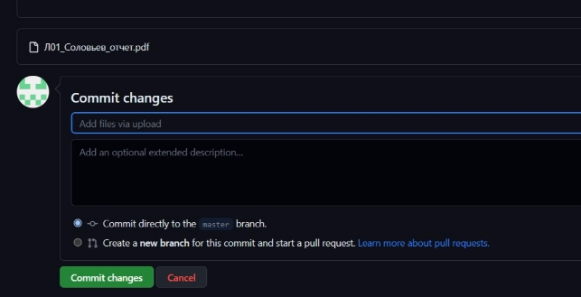

**РОССИЙСКИЙ УНИВЕРСИТЕТ ДРУЖБЫ НАРОДОВ**

**Факультет физико-математических и естественных наук Кафедра прикладной информатики и теории вероятностей**

**ОТЧЕТ** 

**ПО ЛАБОРАТОРНОЙ РАБОТЕ №** 

*дисциплина:       Архитектура компьютера*        

Студент:  Соловьев Богдан Группа:   НКАбд-05-23

**МОСКВА** 2023 г.

**Содержание**

1. **Цель работы…………………………………………………………………………...3**
1. **Задание…………………………………………………………………………………4**
1. **Теоретическое введение……………………………………………………………...5**
1. **Выполнение лабораторной работы…………………………………………………8**
1. **Выводы………………………………………………………………………………...15**
1. **Список Литературы………………………………………………………………….16**
1. **Цель работы**

Целью работы является изучить идеологию и применение средств контроля версий. Приобрести практические навыки по работе с системой git.

2. **Задание**
1. Настройка GitHub
1. Базовая настройка Git
1. Создание SSH-ключа
1. Создание рабочего пространства и репозитория курса на основе шаблона
1. Создание репозитория курса на основе шаблона
1. Настройка каталога курса
1. Выполнение заданий для самостоятельной работы
3. **Теоретическое введение**

Системы контроля версий (Version Control System, VCS) применяются при работе нескольких человек над одним проектом. Обычно основное дерево проекта хранится в локальном или удалённом репозитории, к которому настроен доступ для участников проекта. При внесении изменений в содержание проекта система контроля версий позволяет их фиксировать, совмещать изменения, произведённые разными участниками проекта, производить откат к любой более ранней версии проекта, если это требуется. 

В классических системах контроля версий используется централизованная модель, предполагающая наличие единого репозитория для хранения файлов. Выполнение большинства функций по управлению версиями осуществляется специальным сервером. Участник проекта (пользователь) перед началом работы посредством определённых команд получает нужную ему версию файлов. После внесения изменений, пользователь размещает новую версию в хранилище. При этом предыдущие версии не удаляются из центрального хранилища и к ним можно вернуться в любой момент. Сервер может сохранять не полную версию изменённых файлов, а производить так называемую дельта-компрессию — сохранять только изменения между последовательными версиями, что позволяет уменьшить объём хранимых данных. 

Системы контроля версий поддерживают возможность отслеживания и разрешения конфликтов, которые могут возникнуть при работе нескольких человек над одним файлом. Можно объединить (слить) изменения, сделанные разными участниками (автоматически или вручную), вручную выбрать нужную версию, отменить изменения вовсе или заблокировать файлы для изменения. В зависимости от настроек блокировка не позволяет другим пользователям получить рабочую копию или препятствует изменению рабочей копии файла средствами файловой системы ОС, обеспечивая таким образом, привилегированный доступ только одному пользователю, работающему с файлом. 

ЭВМ Системы контроля версий также могут обеспечивать дополнительные, более гибкие функциональные возможности. Например, они могут поддерживать работу с несколькими версиями одного файла, сохраняя общую историю изменений до точки ветвления версий и собственные истории изменений каждой ветви. Кроме того, обычно доступна информация о том, кто из участников, когда и какие изменения вносил. Обычно такого рода информация хранится в журнале изменений, доступ к которому можно ограничить. 

В отличие от классических, в распределённых системах контроля версий центральный репозиторий не является обязательным. 

Среди классических VCS наиболее известны CVS, Subversion, а среди распределённых — Git, Bazaar, Mercurial. Принципы их работы схожи, отличаются они в основном синтаксисом используемых в работе команд. 

Система контроля версий Git представляет собой набор программ командной строки. Доступ к ним можно получить из терминала посредством ввода команды git с различными опциями. 

Благодаря тому, что Git является распределённой системой контроля версий, резервную копию локального хранилища можно сделать простым копированием или архивацией. 

Основные команды и их описание:

Таблица 1

4. **Выполнение лабораторной работы**
1. **Настройка GitHub**

Учётная запись GitHub у меня уже была, поэтому мне надо было просто зайти на сайт организации и авторизироваться. (Рис.1)

Рис.1 Аккаунт GitHub

2. **Базовая настройка GitHub**

Для того, чтобы выполнить предварительную конфигурацию Git, в своей виртуальной машине открываю терминал и ввожу команду “git config –global user.name ‘<bmsolovjev>’”, а потом команду „git config –global user.email ‘<<bogdan034@outlook.com>>’” (рис.2).

Рис.2 Предварительная конфигурация Git

Настраиваю utf-8 в выводе сообщений (рис.3).

Рис.3 Настройка кодировки utf-8

Задаю имя «master» для начальной ветки (рис.4).

Рис.4 Создание имени «master» для начальной ветки Задаю параметр autocrlf (рис.5).

Рис.5 Задавание параметра  autocrlf Задаю параметр safecrlf (рис.6).

Рис.6 Задавание параметра safecrlf

3. **Создание SSH-ключа**

Для последующей идентификации пользователя на сервере репозиториев необходимо сгенерировать пару ключей (приватный и открытый). Для этого использую команду «ssh-keygen -C “Bogdan Solovjev <<bogdan034@outlook.com>>”». Коюч автоматически сохраняется в каталоге ~/.ssh/.

Рис.7 Создание SSH-ключа Копирую открытый ключ из директории ~/.ssh/

Рис.8 Копирование открытого ключа Вставляю этот ключ в специальное поле «Key»

Рис.9 Добавление открытого ключа в GitHub

4. **Создание рабочего пространства и репозитория курса на основе шаблона**

С помощью команды «mkdir -p ~/work/study/2023-2024/"Архитектура компьютера"» создаю структурированное рабочее пространство (рис.10).

Рис.10 Создание директорий

5. **Создание репозитория на основе шаблона**

Перехожу по ссылке с шаблоном репозитория https://github.com/yamadharma/cour se-directory-student-template, создаю репезиторий и назваю его как на картинке (рис.11).

Рис.11 Создание репозитория по шаблону

Перехожу  каталог курса с помощью команды «cd ~/work/study/2023-                     2024/”Архитектура компьютера”». Потом клонирую созданный репозиторий командой «git clone –recursive <gut@hub.com>:bmsolovjev/study\_2023-2024\_arch-pc.git» (рис.12)

Рис.12 Переход в каталог и клонирование каталога

Ссылку для клонирования можно скопировать на странице созданного репозитория Code -> SSH: 

6. **Настройка каталога курса**

Необходимо удалить файл package.json, для этого я перехожу в директорию study\_2023-2024\_arch-pc и использую команду «rm packege.json» (рис.13)

Рис.13 Переход в каталог и удаление файла Создаю необходимый каталог (рис.14)

Рис.14 Создание каталога

Отправляю данные на сервер командой «git add», потом сохраняю изменения командой «git commit -am» (рис.15)

Рис.15 Отправление и сохранение данных  на сервере GitHub

Отправление изменений в центральный репозиторий командой «git push»(рис.16)

Рис.16

7. **Выполнение заданий для самостоятельной работы**
1. Создаю в директории labs/lab02/report файл с отчётом по второй 

лабораторной работе. 

Рис.17 Создание отчёта

2. Так как я делаю отчёты не на виртуальной машине, мне будет проще вручную скопировать отчёты по лабораторным работам в каталог GitHub. (рис.18)

Рис.18 Перенос файла в каталог вручную

3. Загрузка файла второй лабораторной работы на Github (рис.19)

Рис.19 Создание и отправка файла

Сохраняю изменения командой «git commit -m “Add files”» (рис.20)

Рис.20 Сохранение изменений

5. **Выводы**

Выполнив данную работу, я изучил  идеологию и применение средств контроля версий GitHub, научился взаимодействовать с сервером GitHub и создавать собственные репозитории, добавлять и копировать в них файлы, работать с шаблонами и создавать SSH-ключи.

6. **Список литературы**
1. GDB: The GNU Project Debugger. — URL: <https://www.gnu.org/software/gdb/>.
1. GNU Bash Manual. — 2016. — URL: <https://www.gnu.org/software/bash/manual/>.
1. Midnight Commander Development Center. — 2021. — URL: https://midnight- commander. Org/.
1. NASM Assembly Language Tutorials. — 2021. — URL: <https://asmtutor.com/>.
1. Newham C. Learning the bash Shell: Unix Shell Programming. — O’Reilly Media, 2005. 
   1. 354 с. — (In a Nutshell). — ISBN 0596009658. — URL: <http://www.amazon.com/Learningbash-Shell-Programming-Nutshell/dp/0596009658>.
1. Robbins A. Bash Pocket Reference. — O’Reilly Media, 2016. — 156 с. — ISBN 978- 1491941591.
1. The NASM documentation. — 2021. — URL: <https://www.nasm.us/docs.php>.
1. Zarrelli G. Mastering Bash. — Packt Publishing, 2017. — 502 с. — ISBN 9781784396879.
1. Колдаев В. Д., Лупин С. А. Архитектура ЭВМ. — М. : Форум, 2018.
1. Куляс О. Л., Никитин К. А. Курс программирования на ASSEMBLER. — М. : Солон-Пресс, 2017.
1. Новожилов О. П. Архитектура ЭВМ и систем. — М. : Юрайт, 2016.
1. Расширенный ассемблер: NASM. — 2021. — URL: <https://www.opennet.ru/docs/RUS/nasm/>.
1. Робачевский А., Немнюгин С., Стесик О. Операционная система UNIX. — 2-е изд. 
   1. БХВПетербург, 2010. — 656 с. — ISBN 978-5-94157-538-1.
1. Столяров А. Программирование на языке ассемблера NASM для ОС Unix. — 2-е изд. — М. : МАКС Пресс, 2011. — URL: <http://www.stolyarov.info/books/asm_unix>.
1. Таненбаум Э. Архитектура компьютера. — 6-е изд. — СПб. : Питер, 2013. — 874 с. 
   1. (Классика Computer Science).
1. Таненбаум Э., Бос Х. Современные операционные системы. — 4-е изд. — СПб. : Питер, 2015. — 1120 с. — (Классика Computer Science). 
17
