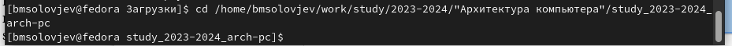
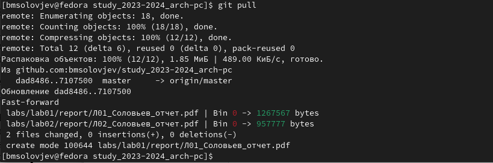

---
## Front matter
title: "Лабораторная работа N3."
subtitle: "Язык разметки Markdown"
author: "Соловьев Богдан Михайлович"

## Generic otions
lang: ru-RU
toc-title: "Содержание"

## Bibliography
bibliography: bib/cite.bib
csl: pandoc/csl/gost-r-7-0-5-2008-numeric.csl

## Pdf output format
toc: true # Table of contents
toc-depth: 2
lof: true # List of figures
lot: true # List of tables
fontsize: 12pt
linestretch: 1.5
papersize: a4
documentclass: scrreprt
## I18n polyglossia
polyglossia-lang:
  name: russian
  options:
	- spelling=modern
	- babelshorthands=true
polyglossia-otherlangs:
  name: english
## I18n babel
babel-lang: russian
babel-otherlangs: english
## Fonts
mainfont: PT Serif
romanfont: PT Serif
sansfont: PT Sans
monofont: PT Mono
mainfontoptions: Ligatures=TeX
romanfontoptions: Ligatures=TeX
sansfontoptions: Ligatures=TeX,Scale=MatchLowercase
monofontoptions: Scale=MatchLowercase,Scale=0.9
## Biblatex
biblatex: true
biblio-style: "gost-numeric"
biblatexoptions:
  - parentracker=true
  - backend=biber
  - hyperref=auto
  - language=auto
  - autolang=other*
  - citestyle=gost-numeric
## Pandoc-crossref LaTeX customization
figureTitle: "Рис."
tableTitle: "Таблица"
listingTitle: "Листинг"
lofTitle: "Список иллюстраций"
lotTitle: "Список таблиц"
lolTitle: "Листинги"
## Misc options
indent: true
header-includes:
  - \usepackage{indentfirst}
  - \usepackage{float} # keep figures where there are in the text
  - \floatplacement{figure}{H} # keep figures where there are in the text
---

# Цель работы

Целью работы является освоение процедуры оформления отчетов с помощью легковесного
языка разметки Markdown.

# Задание

1. Выполнение заданий лабораторной работы
2. Выполнение заданий для самостоятельной работы

# Теоретическое введение

Markdown (МФА: [ˈmɑːkdaʊn], произносится маркда́ун) — облегчённый язык разметки, созданный с целью обозначения форматирования в простом тексте, с максимальным сохранением его читаемости человеком, и пригодный для машинного преобразования в языки для продвинутых публикаций (HTML, Rich Text и других). 

: Описание некоторых каталогов файловой системы GNU Linux {#tbl:std-dir}

| Имя каталога | Описание каталога                                                                                                          |
|--------------|----------------------------------------------------------------------------------------------------------------------------|
| `/`          | Корневая директория, содержащая всю файловую                                                                               |
| `/bin `      | Основные системные утилиты, необходимые как в однопользовательском режиме, так и при обычной работе всем пользователям     |
| `/etc`       | Общесистемные конфигурационные файлы и файлы конфигурации установленных программ                                           |
| `/home`      | Содержит домашние директории пользователей, которые, в свою очередь, содержат персональные настройки и данные пользователя |
| `/media`     | Точки монтирования для сменных носителей                                                                                   |
| `/root`      | Домашняя директория пользователя  `root`                                                                                   |
| `/tmp`       | Временные файлы                                                                                                            |
| `/usr`       | Вторичная иерархия для данных пользователя                                                                                 |

Более подробно об Unix см. в [@gnu-doc:bash;@newham:2005:bash;@zarrelli:2017:bash;@robbins:2013:bash;@tannenbaum:arch-pc:ru;@tannenbaum:modern-os:ru].

# Выполнение лабораторной работы

## Выполнение заданий лабораторной работы

Предварительно установив недостающие пакеты, в терминале перехожу в каталог курса, созданный при выполнении прошлой лабораторной работы (рис. [-@fig:001])

{ #fig:001 width=70%}

Обновляю локальный репозиторий с помощью команды git pull (рис. [-@fig:002])

{ #fig:002 width=70%}

Перехожу в папку report третьей лабораторный работы с помощью команды cd (рис. [-@fig:003])

{ #fig:003 width=70%}

Компилирую шаблон с помощью команды make (рис. [-@fig:004])

{ #fig:004 width=70%}

Проверяю сгенерированный doxc файл (рис. [-@fig:005])

{ #fig:005 width=70%}

Проверяю сгенерированный pdf файл (рис. [-@fig:006])

{ #fig:006 width=70%}

Удаляю полученные файлы с помощью команды make clean, потом ввожу ls, чтобы проверить (рис. [-@fig:007])

{ #fig:007 width=70%}

Открываю report.md и начинаю заполнять отчёт (рис. [-@fig:008])

{ #fig:008 width=70%}

Загружаю файлы на GitHub (рис. [-@fig:009])

{ #fig:009 width=70%}

## Выполнение задач для самостоятельной работы

Чтобы не заполнять отчёт к второй лабораторной работе заново, я воспользуюсь сторонним сайтом, где сконвертирую pdf в markdown. Потом в полученный файл скопирую недостающие элементы из шаблона и исправлю детали, где это нужно. (рис. [-@fig:010])

{ #fig:010 width=70%}

Потом загружаю фалы на GitHub
# Выводы

Здесь кратко описываются итоги проделанной работы.

# Список литературы{.unnumbered}

::: {#refs}
:::
