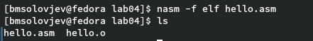

---
## Front matter
title: "Лабораторная работа номер 4"
subtitle: " Создание и процесс обработки программ на языке ассемблера NASM"
author: "Соловбев Богдан Михайович"

## Generic otions
lang: ru-RU
toc-title: "Содержание"

## Bibliography
bibliography: bib/cite.bib
csl: pandoc/csl/gost-r-7-0-5-2008-numeric.csl

## Pdf output format
toc: true # Table of contents
toc-depth: 2
lof: true # List of figures
lot: true # List of tables
fontsize: 12pt
linestretch: 1.5
papersize: a4
documentclass: scrreprt
## I18n polyglossia
polyglossia-lang:
  name: russian
  options:
	- spelling=modern
	- babelshorthands=true
polyglossia-otherlangs:
  name: english
## I18n babel
babel-lang: russian
babel-otherlangs: english
## Fonts
mainfont: PT Serif
romanfont: PT Serif
sansfont: PT Sans
monofont: PT Mono
mainfontoptions: Ligatures=TeX
romanfontoptions: Ligatures=TeX
sansfontoptions: Ligatures=TeX,Scale=MatchLowercase
monofontoptions: Scale=MatchLowercase,Scale=0.9
## Biblatex
biblatex: true
biblio-style: "gost-numeric"
biblatexoptions:
  - parentracker=true
  - backend=biber
  - hyperref=auto
  - language=auto
  - autolang=other*
  - citestyle=gost-numeric
## Pandoc-crossref LaTeX customization
figureTitle: "Рис."
tableTitle: "Таблица"
listingTitle: "Листинг"
lofTitle: "Список иллюстраций"
lotTitle: "Список таблиц"
lolTitle: "Листинги"
## Misc options
indent: true
header-includes:
  - \usepackage{indentfirst}
  - \usepackage{float} # keep figures where there are in the text
  - \floatplacement{figure}{H} # keep figures where there are in the text
---

# Цель работы

Освоение процедуры компиляции и сборки программ, написанных на ассемблере NASM.

# Задание

Здесь приводится описание задания в соответствии с рекомендациями
методического пособия и выданным вариантом.

# Теоретическое введение

## Основные принципы работы компьютера
    Основными функциональными элементами любой электронно-вычислительной машины
(ЭВМ) являются центральный процессор, память и периферийные устройства (рис. 4.1).
Взаимодействие этих устройств осуществляется через общую шину, к которой они подключены. Физически шина представляет собой большое количество проводников, соединяющих
устройства друг с другом. В современных компьютерах проводники выполнены в виде электропроводящих дорожек на материнской (системной) плате.
    Основной задачей процессора является обработка информации, а также организация
координации всех узлов компьютера. В состав центрального процессора (ЦП) входят
следующие устройства:

    • арифметико-логическое устройство (АЛУ) — выполняет логические и арифметические действия, необходимые для обработки информации, хранящейся в памяти;
    • устройство управления (УУ) — обеспечивает управление и контроль всех устройств
    компьютера;
    • регистры — сверхбыстрая оперативная память небольшого объёма, входящая в состав процессора, для временного хранения промежуточных результатов выполнения
    инструкций; регистры процессора делятся на два типа: регистры общего назначения и
    специальные регистры.

    Для того, чтобы писать программы на ассемблере, необходимо знать, какие регистры
процессора существуют и как их можно использовать. Большинство команд в программах
написанных на ассемблере используют регистры в качестве операндов. Практически все
команды представляют собой преобразование данных хранящихся в регистрах процессора,
это например пересылка данных между регистрами или между регистрами и памятью, преобразование (арифметические или логические операции) данных хранящихся в регистрах. 

Структурная схема ЭВМ (рис. @fig:001).

{#fig:001 width=70%}

    Доступ к регистрам осуществляется не по адресам, как к основной памяти, а по именам.
Каждый регистр процессора архитектуры x86 имеет свое название, состоящее из 2 или 3
букв латинского алфавита.
    В качестве примера приведем названия основных регистров общего назначения (именно
эти регистры чаще всего используются при написании программ):
    • RAX, RCX, RDX, RBX, RSI, RDI — 64-битные
    • EAX, ECX, EDX, EBX, ESI, EDI — 32-битные
    • AX, CX, DX, BX, SI, DI — 16-битные
    • AH, AL, CH, CL, DH, DL, BH, BL — 8-битные (половинки 16-битных регистров). Например,
    AH (high AX) — старшие 8 бит регистра AX, AL (low AX) — младшие 8 бит регистра AX.

Регистры процессора (рис. @fig:002).

{#fig:002 width=70%}

Таким образом можно отметить, что вы можете написать в своей программе, например,
такие команды (mov – команда пересылки данных на языке ассемблера):
    mov ax, 1
    mov eax, 1
    Обе команды поместят в регистр AX число 1. Разница будет заключаться только в том, что
вторая команда обнулит старшие разряды регистра EAX, то есть после выполнения второй
команды в регистре EAX будет число 1.А первая команда оставит в старших разрядах регистра
EAX старые данные. И если там были данные, отличные от нуля, то после выполнения первой
команды в регистре EAX будет какое-то число, но не 1. А вот в регистре AX будет число 1.
    Другим важным узлом ЭВМ является оперативное запоминающее устройство (ОЗУ).
ОЗУ — это быстродействующее энергозависимое запоминающее устройство, которое напрямую взаимодействует с узлами процессора, предназначенное для хранения программ и
данных, с которыми процессор непосредственно работает в текущий момент. ОЗУ состоит из
одинаковых пронумерованных ячеек памяти. Номер ячейки памяти — это адрес хранящихся
в ней данных.
    В состав ЭВМ также входят периферийные устройства, которые можно разделить на:
    • устройства внешней памяти, которые предназначены для долговременного хранения больших объёмов данных (жёсткие диски, твердотельные накопители, магнитные ленты);
    • устройства ввода-вывода, которые обеспечивают взаимодействие ЦП с внешней средой.
    
    В основе вычислительного процесса ЭВМ лежит принцип программного управления.
Это означает, что компьютер решает поставленную задачу как последовательность действий,
записанных в виде программы. Программа состоит из машинных команд, которые указывают, какие операции и над какими данными (или операндами), в какой последовательности
необходимо выполнить.
    Набор машинных команд определяется устройством конкретного процессора. Коды команд представляют собой многоразрядные двоичные комбинации из 0 и 1. В коде машинной
команды можно выделить две части: операционную и адресную. В операционной части хранится код команды, которую необходимо выполнить. В адресной части хранятся данные
или адреса данных, которые участвуют в выполнении данной операции.
    При выполнении каждой команды процессор выполняет определённую последовательность стандартных действий, которая называется командным циклом процессора. В
самом общем виде он заключается в следующем:
    1. формирование адреса в памяти очередной команды;
    2. считывание кода команды из памяти и её дешифрация;
    3. выполнение команды;
    4. переход к следующей команде.
    Данный алгоритм позволяет выполнить хранящуюся в ОЗУ программу. Кроме того, в
зависимости от команды при её выполнении могут проходить не все этапы.
Более подробно введение о теоретических основах архитектуры ЭВМ см. в [9; 11].

## Ассемблер и язык ассекмблера

    Язык ассемблера (assembly language, сокращённо asm) — машинно-ориентированный
язык низкого уровня. Можно считать, что он больше любых других языков приближен к
архитектуре ЭВМ и её аппаратным возможностям, что позволяет получить к ним более
полный доступ, нежели в языках высокого уровня,таких как C/C++, Perl, Python и пр. Заметим,
что получить полный доступ к ресурсам компьютера в современных архитектурах нельзя,
самым низким уровнем работы прикладной программы является обращение напрямую к
ядру операционной системы. Именно на этом уровне и работают программы, написанные
на ассемблере. Но в отличие от языков высокого уровня ассемблерная программа содержит
только тот код, который ввёл программист. Таким образом язык ассемблера — это язык, с
помощью которого понятным для человека образом пишутся команды для процессора.
Следует отметить, что процессор понимает не команды ассемблера, а последовательности
из нулей и единиц — машинные коды. До появления языков ассемблера программистам
приходилось писать программы, используя только лишь машинные коды, которые были
крайне сложны для запоминания, так как представляли собой числа, записанные в двоичной
или шестнадцатеричной системе счисления. Преобразование или трансляция команд с
языка ассемблера в исполняемый машинный код осуществляется специальной программой
транслятором — Ассемблер.
Программы, написанные на языке ассемблера, не уступают в качестве и скорости программам, написанным на машинном языке,так как транслятор просто переводит мнемонические
обозначения команд в последовательности бит (нулей и единиц).
Используемые мнемоники обычно одинаковы для всех процессоров одной архитектуры
или семейства архитектур (среди широко известных — мнемоники процессоров и контроллеров x86, ARM, SPARC, PowerPC,M68k). Таким образом для каждой архитектуры существует
свой ассемблер и, соответственно, свой язык ассемблера.
    Наиболее распространёнными ассемблерами для архитектуры x86 являются:
    • для DOS/Windows: Borland Turbo Assembler (TASM), Microsoft Macro Assembler (MASM) и Watcom assembler (WASM);
    • для GNU/Linux: gas (GNU Assembler), использующий AT&T-синтаксис, в отличие от большинства других популярных ассемблеров, которые используют Intel-синтаксис.
    Более подробно о языке ассемблера см., например, в [10].
    В нашем курсе будет использоваться ассемблер NASM (Netwide Assembler) [7; 12; 14].
    NASM — это открытый проект ассемблера, версии которого доступны под различные
операционные системы и который позволяет получать объектные файлы для этих систем. В
NASM используется Intel-синтаксис и поддерживаются инструкции x86-64.
Типичный формат записи команд NASM имеет вид:
    [метка:] мнемокод [операнд {, операнд}] [; комментарий]
Здесь мнемокод— непосредственно мнемоника инструкции процессору, которая является
обязательной частью команды. Операндами могут быть числа,данные, адреса регистров или
адреса оперативной памяти. Метка — это идентификатор, с которым ассемблер ассоциирует
некоторое число, чаще всего адрес в памяти. Т.о. метка перед командой связана с адресом
данной команды.
    Допустимыми символами в метках являются буквы, цифры, а также следующие символы:
        _, $, #, @,~,. и ?.
    Начинаться метка или идентификатор могут с буквы, ., _ и ?. Перед идентификаторами,
которые пишутся как зарезервированные слова, нужно писать $, чтобы компилятор трактовал его верно (так называемое экранирование). Максимальная длина идентификатора 4095
символов.
    Программа на языке ассемблера также может содержать директивы — инструкции, не переводящиеся непосредственно в машинные команды, а управляющие работой транслятора.
Например, директивы используются для определения данных (констант и переменных) и
обычно пишутся большими буквами.

## Процесс создания и обработки программы на языке ассемблера

Процесс создания ассемблерной программы можно изобразить в виде следующей схемы (рис. @fig:003).

{#fig:003 width=70%}

В процессе создания ассемблерной программы можно выделить четыре шага:

    • Набор текста программы в текстовом редакторе и сохранение её в отдельном файле.
    Каждый файл имеет свой тип (или расширение), который определяет назначение файла.
    Файлы с исходным текстом программ на языке ассемблера имеют тип asm.
    • Трансляция — преобразование с помощью транслятора, например nasm, текста программы в машинный код, называемый объектным. На данном этапе также может быть
    получен листинг программы, содержащий кроме текста программы различную дополнительную информацию, созданную транслятором. Тип объектного файла — o, файла
    листинга — lst.
    • Компоновка или линковка — этап обработки объектного кода компоновщиком (ld),
    который принимает на вход объектные файлы и собирает по ним исполняемый файл.
    Исполняемый файл обычно не имеет расширения. Кроме того, можно получить файл
    карты загрузки программы в ОЗУ, имеющий расширение map.
    • Запуск программы. Конечной целью является работоспособный исполняемый файл.
    Ошибки на предыдущих этапах могут привести к некорректной работе программы,
    поэтому может присутствовать этап отладки программы при помощи специальной
    программы — отладчика. При нахождении ошибки необходимо провести коррекцию
    программы, начиная с первого шага.

    Из-за специфики программирования, а также по традиции для создания программ на языке ассемблера обычно пользуются утилитами командной строки (хотя поддержка ассемблера
есть в некоторых универсальных интегрированных средах).

| Имя каталога | Описание каталога                                                                                                          |
|--------------|----------------------------------------------------------------------------------------------------------------------------|
| `/`          | Корневая директория, содержащая всю файловую                                                                               |
| `/bin `      | Основные системные утилиты, необходимые как в однопользовательском режиме, так и при обычной работе всем пользователям     |
| `/etc`       | Общесистемные конфигурационные файлы и файлы конфигурации установленных программ                                           |
| `/home`      | Содержит домашние директории пользователей, которые, в свою очередь, содержат персональные настройки и данные пользователя |
| `/media`     | Точки монтирования для сменных носителей                                                                                   |
| `/root`      | Домашняя директория пользователя  `root`                                                                                   |
| `/tmp`       | Временные файлы                                                                                                            |
| `/usr`       | Вторичная иерархия для данных пользователя                                                                                 |

Более подробно об Unix см. в [@gnu-doc:bash;@newham:2005:bash;@zarrelli:2017:bash;@robbins:2013:bash;@tannenbaum:arch-pc:ru;@tannenbaum:modern-os:ru].

# Выполнение лабораторной работы

## Программа Hello World!

Создаю в папке "work" новую папку lab04 командой "mkdir" и перехожу в неё командой cd (рис. @fig:004).

{#fig:004 width=70%}

Создаю текстовый файл "hello.asm" и открываю его (рис. @fig:005).

{#fig:005 width=70%}

Ввожу в созданный файл скопированный текст (рис. @fig:006).

{#fig:006 width=70%}

## Транслятор NASM

Компилирую файл hello.asm(рис. @fig:007).

{#fig:007 width=70%}

## Расширенный синтаксис командной строки NASM

Выполняю следующую команду (рис. @fig:008).

{#fig:008 width=70%}

## Компоновщик LD

Объектный файл передаю на обработку компоновщику (рис. @fig:009).

{#fig:009 width=70%}

Выполняю следующую команду (рис. @fig:010).

{#fig:010 width=70%}

## Запуск исполняемого файла

Запускаю исполняемый файл(рис. @fig:011).

{#fig:011 width=70%}

# Задания для самостоятельной работы 

Создаю копию файла и переименовываю его (рис. @fig:012).

{#fig:012 width=70%}

Вношу изменения в текст программы, чтобы она выводила моё Имя и Фамилию (рис. @fig:013).

{#fig:013 width=70%}

Создаю объектный файл (рис. @fig:014).

{#fig:014 width=70%}

Создаю исполняемый файл (рис. @fig:015).

{#fig:015 width=70%}

Запускаю файл (рис. @fig:016).

{#fig:016 width=70%}

Копирую файл и переношу его (рис. @fig:017).

{#fig:017 width=70%}

Отправляю изменения на GitHub(рис. @fig:018).

{#fig:018 width=70%}
# Выводы

Я освоил процедуры компиляции и сборки программ, написанных на ассемблере NASM.

# Список литературы{.unnumbered}

::: {#refs}
:::
