---
## Front matter
title: "Лабораторная работа 5"
subtitle: "Отчёт"
author: "Соловьев Богдан Михайлович"

## Generic otions
lang: ru-RU
toc-title: "Содержание"

## Bibliography
bibliography: bib/cite.bib
csl: pandoc/csl/gost-r-7-0-5-2008-numeric.csl

## Pdf output format
toc: true # Table of contents
toc-depth: 2
lof: true # List of figures
lot: true # List of tables
fontsize: 12pt
linestretch: 1.5
papersize: a4
documentclass: scrreprt
## I18n polyglossia
polyglossia-lang:
  name: russian
  options:
	- spelling=modern
	- babelshorthands=true
polyglossia-otherlangs:
  name: english
## I18n babel
babel-lang: russian
babel-otherlangs: english
## Fonts
mainfont: PT Serif
romanfont: PT Serif
sansfont: PT Sans
monofont: PT Mono
mainfontoptions: Ligatures=TeX
romanfontoptions: Ligatures=TeX
sansfontoptions: Ligatures=TeX,Scale=MatchLowercase
monofontoptions: Scale=MatchLowercase,Scale=0.9
## Biblatex
biblatex: true
biblio-style: "gost-numeric"
biblatexoptions:
  - parentracker=true
  - backend=biber
  - hyperref=auto
  - language=auto
  - autolang=other*
  - citestyle=gost-numeric
## Pandoc-crossref LaTeX customization
figureTitle: "Рис."
tableTitle: "Таблица"
listingTitle: "Листинг"
lofTitle: "Список иллюстраций"
lotTitle: "Список таблиц"
lolTitle: "Листинги"
## Misc options
indent: true
header-includes:
  - \usepackage{indentfirst}
  - \usepackage{float} # keep figures where there are in the text
  - \floatplacement{figure}{H} # keep figures where there are in the text
---

# Цель работы

Приобретение практических навыков работы в Midnight Commander. Освоение инструкций
языка ассемблера mov и int.

# Теоретическое введение

Midnight Commander (или просто mc) — это программа, которая позволяет просматривать
структуру каталогов и выполнять основные операции по управлению файловой системой,
т.е. mc является файловым менеджером. Midnight Commander позволяет сделать работу с
файлами более удобной и наглядной.
Для активации оболочки Midnight Commander достаточно ввести в командной строке mc и
нажать клавишу Enter (рис. 5.1).
В Midnight Commander используются функциональные клавиши F1 — F10 , к которым
привязаны часто выполняемые операции.

Архитектура ЭВМ
Функцио-
нальные
клавиши Выполняемое действие
F5 копирование файла или группы отмеченных файлов из каталога,
отображаемого в активной панели, в каталог, отображаемый на второй
панели
F6 перенос файла или группы отмеченных файлов из каталога, отображаемого
в активной панели, в каталог, отображаемый на второй панели
F7 создание подкаталога в каталоге, отображаемом в активной панели
F8 удаление файла (подкаталога) или группы отмеченных файлов
F9 вызов основного меню программы
F10 выход из программы

Следующие комбинации клавиш облегчают работу с Midnight Commander:
• Tab используется для переключениями между панелями;
• ↑ и ↓ используется для навигации, Enter для входа в каталог или открытия файла
(если в файле расширений mc.ext заданы правила связи определённых расширений
файлов с инструментами их запуска или обработки);
• Ctrl + u (или через меню Команда > Переставить панели ) меняет местами содержимое
правой и левой панелей;
• Ctrl + o (или через меню Команда > Отключить панели ) скрывает или возвращает панели
Midnight Commander, за которыми доступен для работы командный интерпретатор
оболочки и выводимая туда информация.
• Ctrl + x + d (или через меню Команда > Сравнить каталоги ) позволяет сравнить содер-
жимое каталогов, отображаемых на левой и правой панелях.

Программа на языке ассемблера NASM, как правило, состоит из трёх секций: секция кода
программы (SECTION .text), секция инициированных (известных во время компиляции)
данных (SECTION .data) и секция неинициализированных данных (тех, под которые во
время компиляции только отводится память, а значение присваивается в ходе выполнения
программы) (SECTION .bss).
Таким образом, общая структура программы имеет следующий вид:
```
SECTION .data ; Секция содержит переменные, для
... ; которых задано начальное значение
```
# Выполнение лабораторной работы

## Лабораторная работа

Открываю Midnight Commabnder (предварительно скачав библиотеку) написав в командной строке mc (рис. @fig:001).

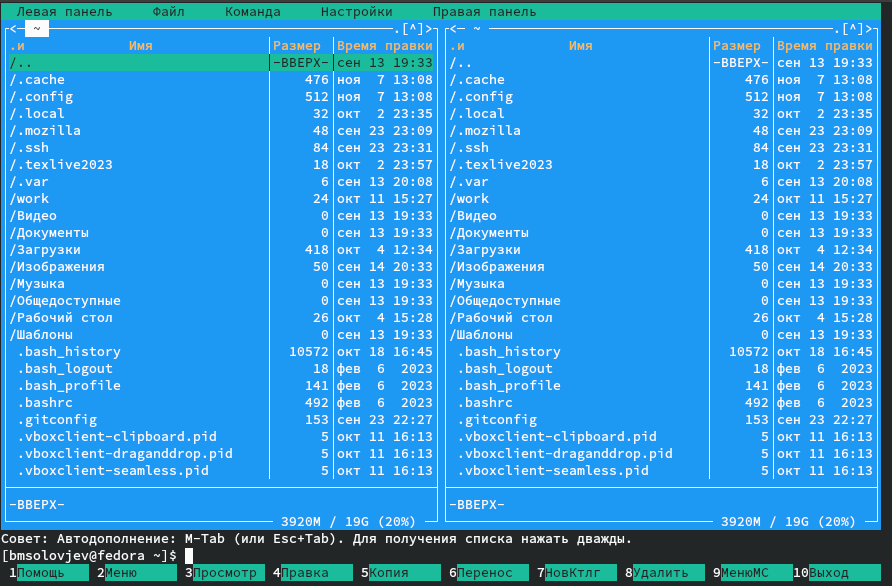{#fig:001 width=70%}

Создаю каталог lab05 с помощью встроенных функций mc(рис. @fig:002).

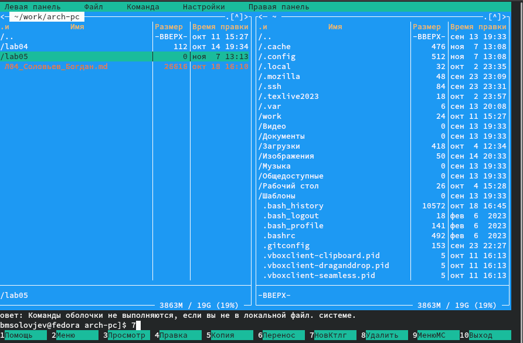{#fig:002 width=70%}

Ввожу в созданных файл код программы, которая будет запрашивать текст (рис. @fig:004).

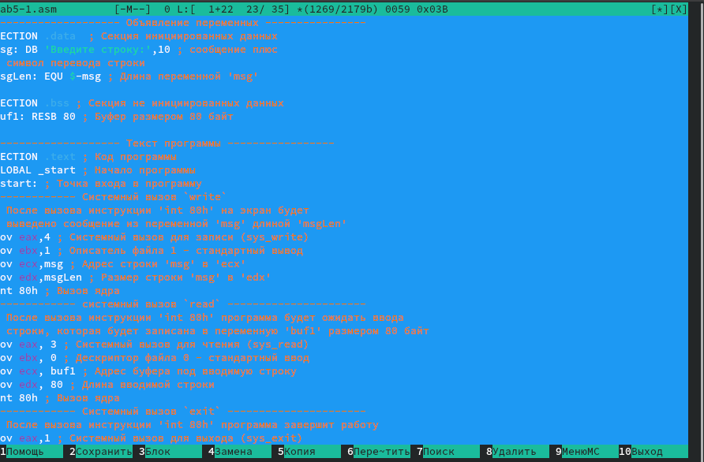{#fig:004 width=70%}

Создаю объектный и сполняемый файл с помощью -f elf lab5-1.asm и lab5-1.o (рис. @fig:005).

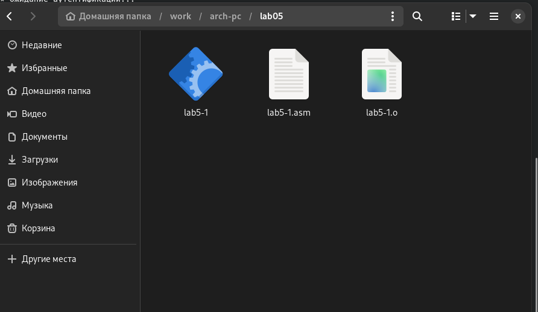{#fig:005 width=70%}

Запускаю исполняемый файл (рис. @fig:006).

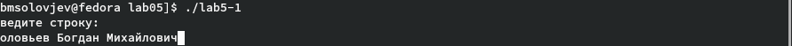{#fig:006 width=70%}

Скачиваю файл in_out.asm и переношу его в каталог lab05 (рис. @fig:007).

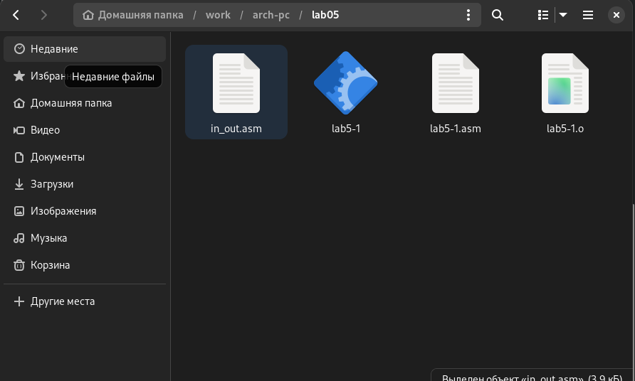{#fig:007 width=70%}

Копирую файл lab5-1.asm и изменяю его название (рис. @fig:008).

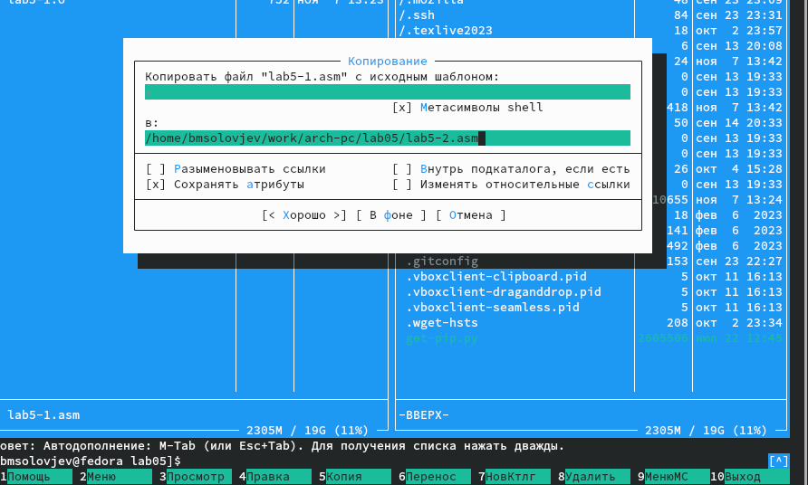{#fig:008 width=70%}

Изменяю текст программы lab5-2.asm (рис. @fig:009).

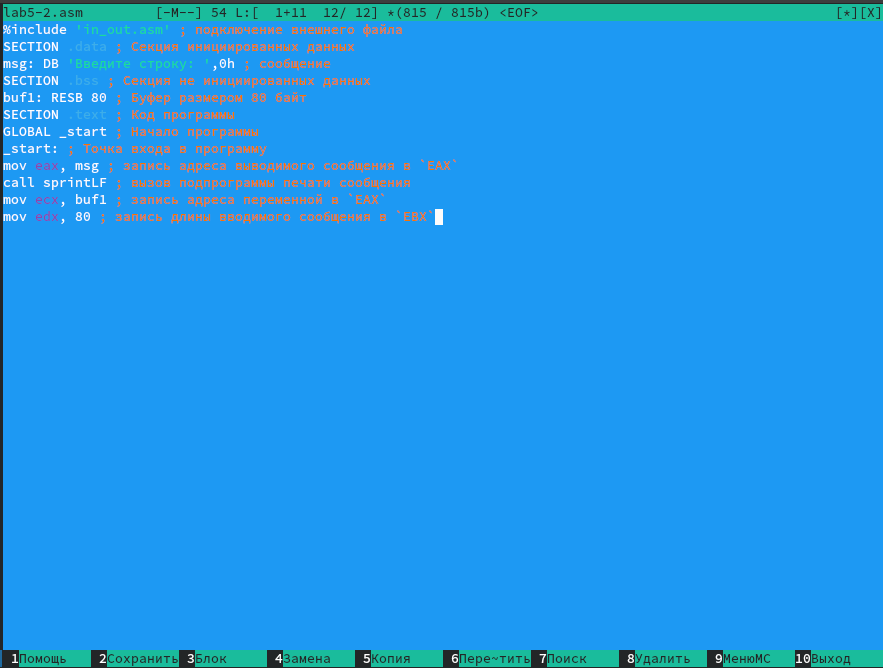{#fig:009 width=70%}

Создание объектного и исполняемого файла и проверка работы команды (рис. @fig:010).

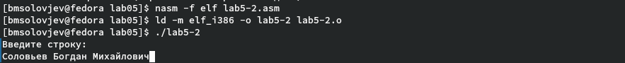{#fig:010 width=70%}

Изменяю текст программы, прописывая sprint вместо sprintLF(рис. @fig:011).

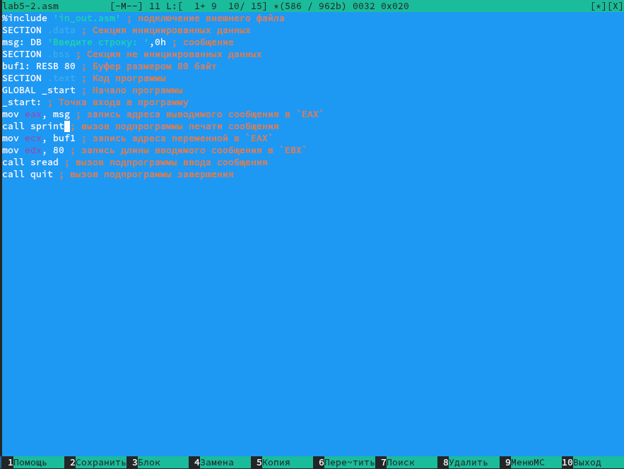{#fig:011 width=70%}

Повторяю свои действия в третий раз (рис. @fig:012).

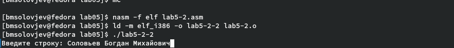{#fig:012 width=70%}

## Самостоятельная работа

Создаю файл lab5-1-1.asm и вставляю в него новый код (рис. @fig:013).

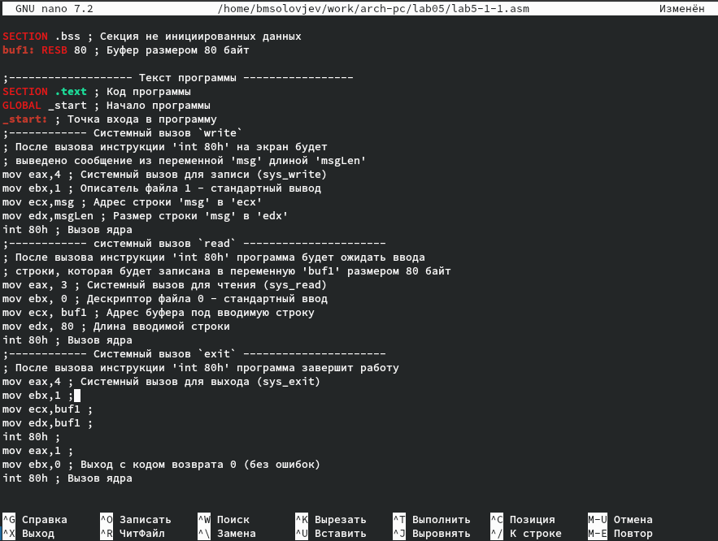{#fig:013 width=70%}

Повторяю свои действия в четвёртый раз (рис. @fig:014).

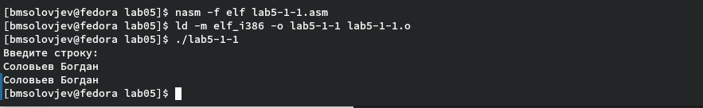{#fig:014 width=70%}

Создаю файл lab5-2-1.asm и вставляю в него новый код (рис. @fig:015).

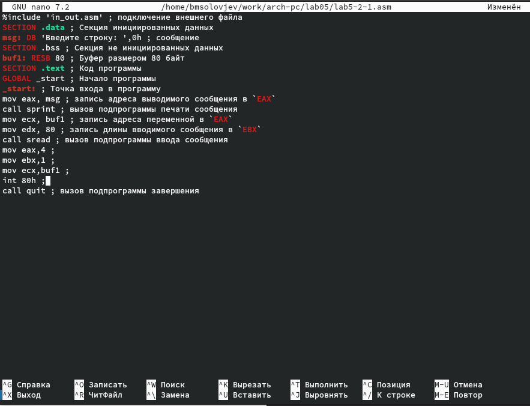{#fig:015 width=70%}

Повторяю свои действия в пятый раз (рис. @fig:016).

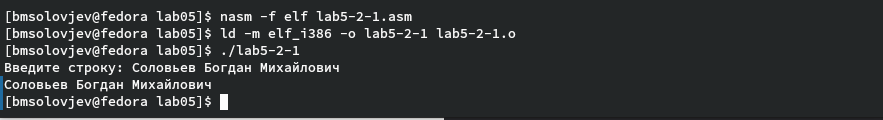{#fig:016 width=70%}


# Выводы

При выполнении лабораторной работы, я приобрёл навыки работы в Midnight Commander, а также узнал принцип работы mov, int, print, printLF на языке программирования NASM.  

# Список литературы{.unnumbered}

::: {#refs}
:::
