---
## Front matter
title: "Отчёт по лабораторной работе N6"
subtitle: "Арифметические операции в NASM"
author: "Соловьев Богдан Михайлович"

## Generic otions
lang: ru-RU
toc-title: "Содержание"

## Bibliography
bibliography: bib/cite.bib
csl: pandoc/csl/gost-r-7-0-5-2008-numeric.csl

## Pdf output format
toc: true # Table of contents
toc-depth: 2
lof: true # List of figures
lot: true # List of tables
fontsize: 12pt
linestretch: 1.5
papersize: a4
documentclass: scrreprt
## I18n polyglossia
polyglossia-lang:
  name: russian
  options:
	- spelling=modern
	- babelshorthands=true
polyglossia-otherlangs:
  name: english
## I18n babel
babel-lang: russian
babel-otherlangs: english
## Fonts
mainfont: PT Serif
romanfont: PT Serif
sansfont: PT Sans
monofont: PT Mono
mainfontoptions: Ligatures=TeX
romanfontoptions: Ligatures=TeX
sansfontoptions: Ligatures=TeX,Scale=MatchLowercase
monofontoptions: Scale=MatchLowercase,Scale=0.9
## Biblatex
biblatex: true
biblio-style: "gost-numeric"
biblatexoptions:
  - parentracker=true
  - backend=biber
  - hyperref=auto
  - language=auto
  - autolang=other*
  - citestyle=gost-numeric
## Pandoc-crossref LaTeX customization
figureTitle: "Рис."
tableTitle: "Таблица"
listingTitle: "Листинг"
lofTitle: "Список иллюстраций"
lotTitle: "Список таблиц"
lolTitle: "Листинги"
## Misc options
indent: true
header-includes:
  - \usepackage{indentfirst}
  - \usepackage{float} # keep figures where there are in the text
  - \floatplacement{figure}{H} # keep figures where there are in the text
---

# Цель работы

Освоение арифметических инструкций языка ассемблера NASM

# Теоретическое введение

Большинство инструкций на языке ассемблера требуют обработки операндов. Адрес опе-
ранда предоставляет место, где хранятся данные, подлежащие обработке. Это могут быть
данные хранящиеся в регистре или в ячейке памяти. Далее рассмотрены все существующие
способы задания адреса хранения операндов – способы адресации.
Существует три основных способа адресации:
• Регистровая адресация – операнды хранятся в регистрах и в команде используются
имена этих регистров, например: mov ax,bx.
• Непосредственная адресация – значение операнда задается непосредственно в ко-
манде, Например: mov ax,2.
• Адресация памяти – операнд задает адрес в памяти. В команде указывается символи-
ческое обозначение ячейки памяти, над содержимым которой требуется выполнить
операцию.
Например, определим переменную intg DD 3 – это означает, что задается область памяти
размером 4 байта, адрес которой обозначен меткой intg. В таком случае, команда
mov eax,[intg]
копирует из памяти по адресу intg данные в регистр eax. В свою очередь команда
mov [intg],eax
запишет в память по адресу intg данные из регистра eax.
Также рассмотрим команду
mov eax,intg
В этом случае в регистр eax запишется адрес intg. Допустим, для intg выделена память
начиная с ячейки с адресом 0x600144, тогда команда mov eax,intg аналогична команде mov
eax,0x600144 – т.е. эта команда запишет в регистр eax число 0x600144.


Ввод информации с клавиатуры и вывод её на экран осуществляется в символьном виде.
Кодирование этой информации производится согласно кодовой таблице символов ASCII.
ASCII – сокращение от American Standard Code for Information Interchange (Американский
стандартный код для обмена информацией). Согласно стандарту ASCII каждый символ
кодируется одним байтом.
Расширенная таблица ASCII состоит из двух частей. Первая (символы с кодами 0-127)
является универсальной (см. Приложение.), а вторая (коды 128-255) предназначена для
специальных символов и букв национальных алфавитов и на компьютерах разных типов
может меняться.
Среди инструкций NASM нет такой, которая выводит числа (не в символьном виде). По-
этому, например, чтобы вывести число, надо предварительно преобразовать его цифры в
ASCII-коды этих цифр и выводить на экран эти коды, а не само число. Если же выводить число
на экран непосредственно, то экран воспримет его не как число, а как последовательность
ASCII-символов – каждый байт числа будет воспринят как один ASCII-символ – и выведет на
экран эти символы.
Аналогичная ситуация происходит и при вводе данных с клавиатуры. Введенные дан-
ные будут представлять собой символы, что сделает невозможным получение корректного
результата при выполнении над ними арифметических операций.
Для решения этой проблемы необходимо проводить преобразование ASCII символов в
числа и обратно.
Для выполнения лабораторных работ в файле in_out.asm реализованы подпрограммы
для преобразования ASCII символов в числа и обратно. Это:
• iprint – вывод на экран чисел в формате ASCII, перед вызовом iprint в регистр eax
необходимо записать выводимое число (mov eax,<int>).
• iprintLF – работает аналогично iprint, но при выводе на экран после числа добавляет
к символ перевода строки.
• atoi – функция преобразует ascii-код символа в целое число и записает результат
в регистр eax, перед вызовом atoi в регистр eax необходимо записать число (mov
eax,<int>).

# Выполнение лабораторной работы

## Выполнение заданий лабораторной работы

Создаю новую директорию и новый файл lab6-1.asm (рис. @fig:001).

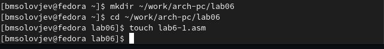{#fig:001 width=70%}

Записываю в файл lab6-1.asm код программы (рис. @fig:002).

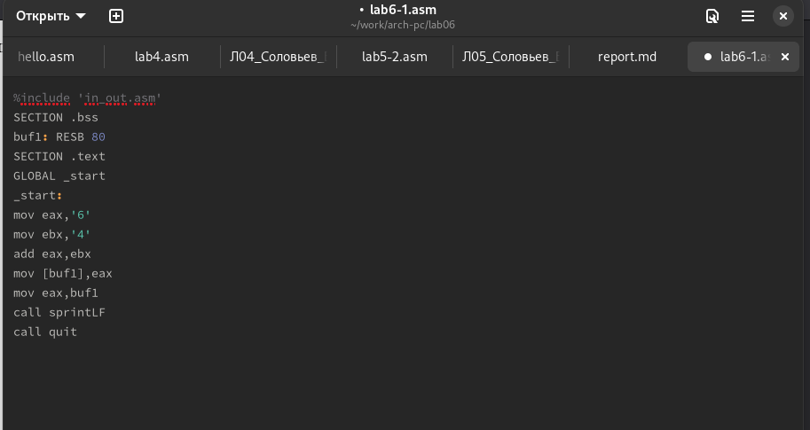{#fig:002 width=70%}

Меняю в коде "4" и "6" на 4 и 6. Создаю и запускаю исполяемый файл (рис. @fig:003).

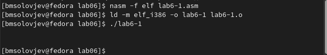{#fig:003 width=70%}

Создаю новый файл (рис. @fig:004).

{#fig:004 width=70%}

В файл lab6-2.asm копирую другой текст программы и запуская исполняемый файл (рис. @fig:005).

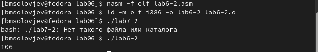{#fig:005 width=70%}

Меняю в коде программы lab6-2.asm "6" и "4" на 6 и 4 (рис. @fig:006).

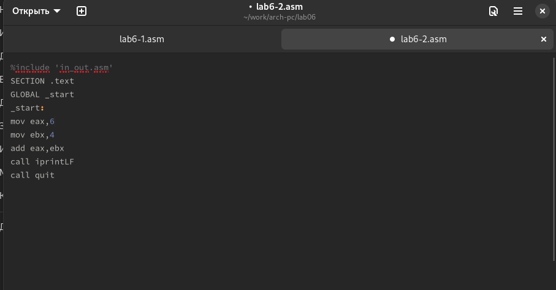{#fig:006 width=70%}

Запускаю изменённый код программы (рис. @fig:007).

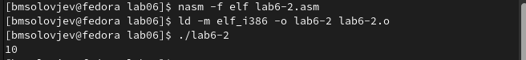{#fig:007 width=70%}

Создаю новый файл lab6-3.asm (рис. @fig:010).

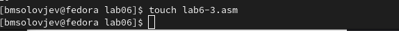{#fig:010 width=70%}

В этот файл я вставляю текст другой программы и запускаю программу(рис. @fig:011).

{#fig:011 width=70%}

Меняю код программы так, чтобы она вычисляла значение функции f(x) = (4 * 6 + 2)/5 (рис. @fig:012).

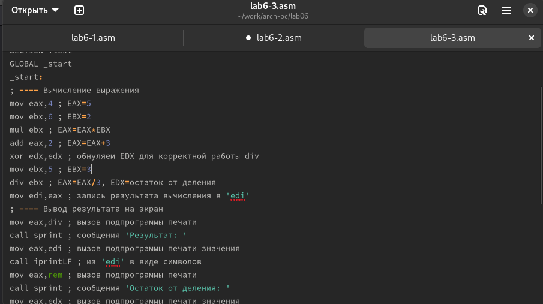{#fig:012 width=70%}

Запускаю иcполняемый файл программы lab6-3 (рис. @fig:013).

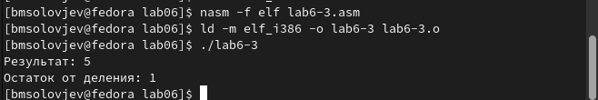{#fig:013 width=70%}

## Отаеты на дополнительные вопросы

1. Какие строки листинга 6.4 отвечают за вывод на экран сообщения ‘Ваш вариант:’?
За вывод этих строк отвечают строки кода:
```NASM
mov eax,rem
call sprint
```
2. Для чего используется следующие инструкции?
```NASM
mov ecx, x ; перемещаем адрес строки x в регистр ecx
mov edx, 80 ; запись в регистр edx длины вводимой строки
call sread ; вызов подпрограммы, которая считывает сооб
```

3. Для чего используется инструкция “call atoi”?
Эта инструкция преобразует ASCII код строки в целое число и записывает результат в регистр eax

4. Какие строки листинга 6.4 отвечают за вычисления варианта?
За листинг отвечают следующие строки:
```NASM
xor edx,edx ; обнуление edx для корректной работы div
mov ebx,20 ; ebx = 20
div ebx ; eax = eax/20, edx - остаток от деления
inc edx ; edx = edx + 1
```

5. В какой регистр записывается остаток от деления при выполнении инструкции “div ebx”?
Остаток от деления записывается в регистр edx

6. Для чего используется инструкция “inc edx”?
Эта инструкция увеличивает значение регистра edx на 1

7. Какие строки листинга 6.4 отвечают за вывод на экран результата вычислений?
За вывод на экран результатов вычислений отвечают строки:

```NASM
mov eax,edx
call iprintLF
```

## Задачи для самостоятельного решения

Создаю файл nomervar.asm, где ввожу код для программы, которая будет выводить номер варианта (рис. @fig:014).

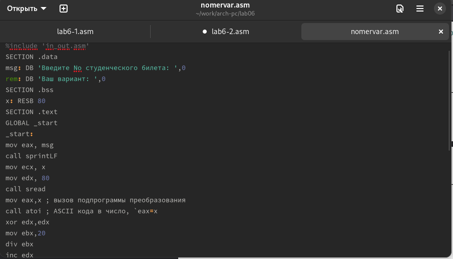{#fig:014 width=70%}

Запускаю программу (рис. @fig:015).

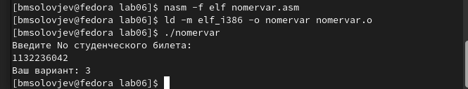{#fig:015 width=70%}

Код моей программы (рис. @fig:016).

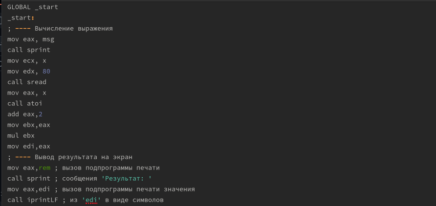{#fig:016 width=70%}

Проверка моей программы (рис. @fig:017).

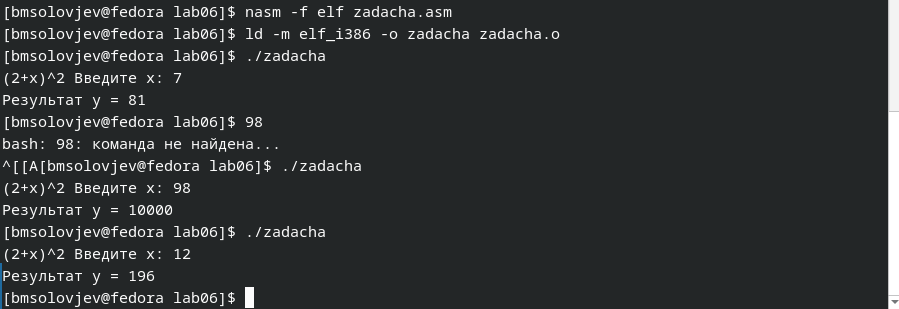{#fig:017 width=70%}

# Выводы

При выполнении данной лабораторной работы я освоил арифметические инструкции языка ассемблера NASM.

# Список литературы{.unnumbered}

::: {#refs}
:::
