---
## Front matter
title: "Лабораторнрая работа №7"
subtitle: "Команды безусловного и условного переходов в Nasm. Программирование ветвлений."
author: "Соловьев Богдан Михайлович НКАбд-05-23"

## Generic otions
lang: ru-RU
toc-title: "Содержание"

## Bibliography
bibliography: bib/cite.bib
csl: pandoc/csl/gost-r-7-0-5-2008-numeric.csl

## Pdf output format
toc: true # Table of contents
toc-depth: 2
lof: true # List of figures
lot: true # List of tables
fontsize: 12pt
linestretch: 1.5
papersize: a4
documentclass: scrreprt
## I18n polyglossia
polyglossia-lang:
  name: russian
  options:
	- spelling=modern
	- babelshorthands=true
polyglossia-otherlangs:
  name: english
## I18n babel
babel-lang: russian
babel-otherlangs: english
## Fonts
mainfont: PT Serif
romanfont: PT Serif
sansfont: PT Sans
monofont: PT Mono
mainfontoptions: Ligatures=TeX
romanfontoptions: Ligatures=TeX
sansfontoptions: Ligatures=TeX,Scale=MatchLowercase
monofontoptions: Scale=MatchLowercase,Scale=0.9
## Biblatex
biblatex: true
biblio-style: "gost-numeric"
biblatexoptions:
  - parentracker=true
  - backend=biber
  - hyperref=auto
  - language=auto
  - autolang=other*
  - citestyle=gost-numeric
## Pandoc-crossref LaTeX customization
figureTitle: "Рис."
tableTitle: "Таблица"
listingTitle: "Листинг"
lofTitle: "Список иллюстраций"
lotTitle: "Список таблиц"
lolTitle: "Листинги"
## Misc options
indent: true
header-includes:
  - \usepackage{indentfirst}
  - \usepackage{float} # keep figures where there are in the text
  - \floatplacement{figure}{H} # keep figures where there are in the text
---

# Цель работы

Изучение команд условного и безусловного переходов. Приобретение навыков написания
программ с использованием переходов. Знакомство с назначением и структурой файла
листинга.

# Теоретическое введение

Для реализации ветвлений в ассемблере используются так называемые команды передачи управления или команды перехода. 

Можно выделить 2 типа переходов:

• условный переход – выполнение или не выполнение перехода в определенную точку программы в зависимости от проверки условия.
• безусловный переход – выполнение передачи управления в определенную точку программы без каких-либо условий.

Безусловный переход выполняется инструкцией jmp (от англ. jump – прыжок), которая включает в себя адрес перехода, куда следует передать управление:

jmp <адрес_перехода>

Адрес перехода может быть либо меткой, либо адресом области памяти, в которую предварительно помещен указатель перехода. Кроме того, в качестве операнда можно использовать имя регистра, в таком случае переход будет осуществляться по адресу, хранящемуся в этом регистре

Команда условного перехода имеет вид

j<мнемоника перехода> label

Мнемоника перехода связана со значением анализируемых флагов или со способом формирования этих флагов.

В их мнемокодах указывается тот результат сравнения, при котором надо делать переход. Мнемоники, идентичные по своему действию, написаны в таблице
через дробь (например, ja и jnbe). Программист выбирает, какую из них применить, чтобы
получить более простой для понимания текст программы.

# Выполнение лабораторной работы

Создаю файл lab7-1.asm (рис. @fig:001).

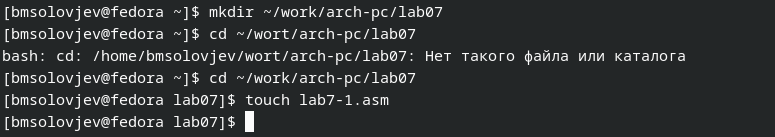{#fig:001 width=70%}

Ввожу в файл lab7-1.asm код программы с использованием jmp (рис. @fig:002).

```ASM
%include 'in_out.asm' ; подключение внешнего файла
SECTION .data
msg1: DB 'Сообщение № 1',0
msg2: DB 'Сообщение № 2',0
msg3: DB 'Сообщение № 3',0
SECTION .text
GLOBAL _start
_start:
jmp _label2
_label1:
mov eax, msg1 ; Вывод на экран строки
call sprintLF ; 'Сообщение № 1'
_label2:
mov eax, msg2 ; Вывод на экран строки
call sprintLF ; 'Сообщение № 2'
_label3:
mov eax, msg3 ; Вывод на экран строки
call sprintLF ; 'Сообщение № 3'
_end:
call quit ; вызов подпрограммы завершения
```
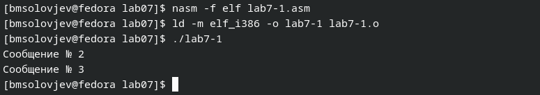{#fig:002 width=70%}

Изменение файла lab7-1.asm, после которого программа выводит сначала сообщение 2, потом сообщение 1 (рис. @fig:003).

```ASM
%include 'in_out.asm' ; подключение внешнего файла
SECTION .data
msg1: DB 'Сообщение № 1',0
msg2: DB 'Сообщение № 2',0
msg3: DB 'Сообщение № 3',0
SECTION .text
GLOBAL _start
_start:
jmp _label2
_label1:
mov eax, msg1 ; Вывод на экран строки
call sprintLF ; 'Сообщение № 1'
jmp _end
_label2:
mov eax, msg2 ; Вывод на экран строки
call sprintLF ; 'Сообщение № 2'
jmp _label1
_label3:
mov eax, msg3 ; Вывод на экран строки
call sprintLF ; 'Сообщение № 3'
_end:
call quit ; вызов подпрограммы завершения
```

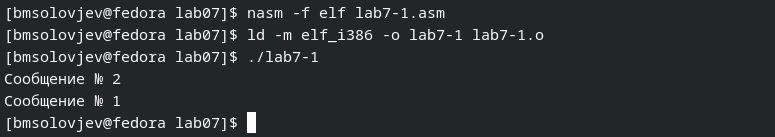{#fig:003 width=70%}

Теперь изменяю файл lab7-1.asm таким образом, чтобы она выводил все сообщения (рис. @fig:004).

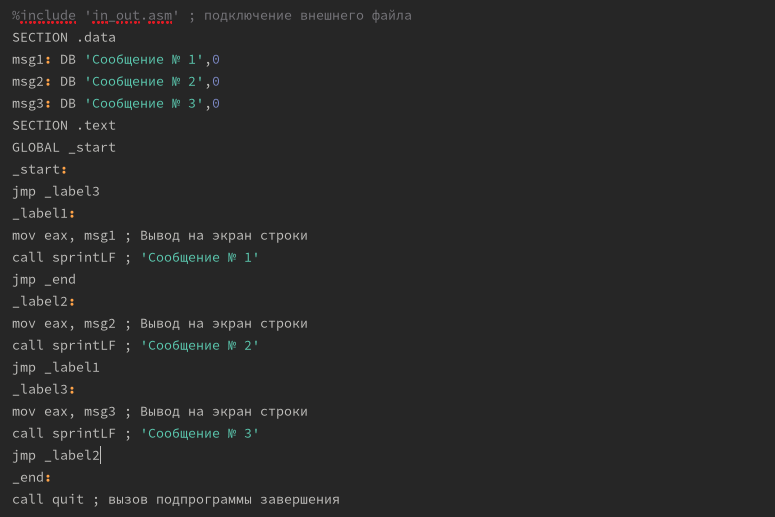{#fig:004 width=70%}

Проверка работы моего кода (рис. @fig:005).

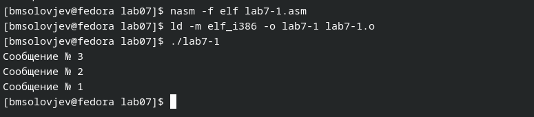{#fig:005 width=70%}

Код программы, сравнивающей 3 числа (рис. @fig:006).

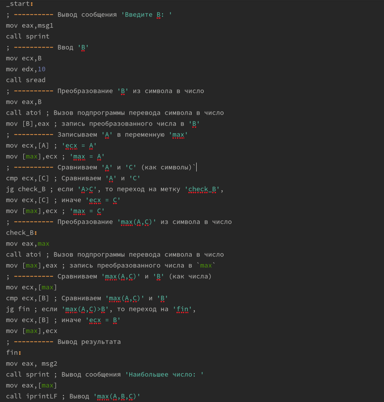{#fig:006 width=70%}

Проверка работы кода, сравнивающего 3 числа (рис. @fig:007).

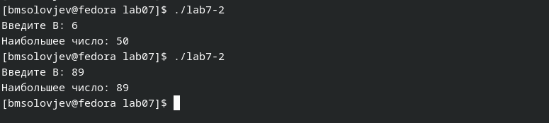{#fig:007 width=70%}

Создаю файл листинга и открываю его с помощью текстового редактора. 14 строка вычитает из значения, находящегося в регистре eax, значение, находящееся в регистре ebx. 15 строка берёт из стека значение, адрес которого находится в регистре ebx. 16 строка выполняет возврат из процедуры (рис. @fig:007).

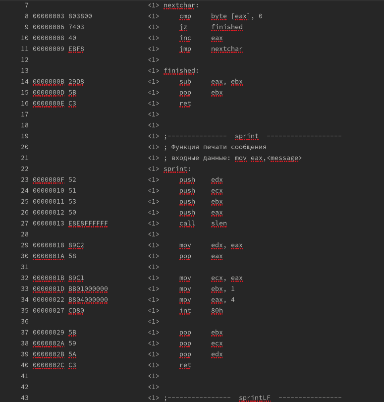{#fig:008 width=70%}

Удаляю один операнд из инструкции mov и получаю ошибку (рис. @fig:009).

```ASM
%include 'in_out.asm'
section .data
msg1 db 'Введите B: ',0h
msg2 db "Наибольшее число: ",0h
A dd '20'
C dd '50'
section .bss
max resb 10
B resb 10
section .text
global _start
_start:
; ---------- Вывод сообщения 'Введите B: '
mov eax,msg1
call sprint
; ---------- Ввод 'B'
mov ecx,B
mov edx,10
call sread
; ---------- Преобразование 'B' из символа в число
mov eax,B
call atoi ; Вызов подпрограммы перевода символа в число
mov [B],eax ; запись преобразованного числа в 'B'
; ---------- Записываем 'A' в переменную 'max'
mov ecx, ; [A] УДАЛИЛ ТУТ
mov [max],ecx ; 'max = A'
; ---------- Сравниваем 'A' и 'С' (как символы)`
cmp ecx,[C] ; Сравниваем 'A' и 'С'
jg check_B ; если 'A>C', то переход на метку 'check_B',
mov ecx,[C] ; иначе 'ecx = C'
mov [max],ecx ; 'max = C'
; ---------- Преобразование 'max(A,C)' из символа в число
check_B:
mov eax,max
call atoi ; Вызов подпрограммы перевода символа в число
mov [max],eax ; запись преобразованного числа в `max`
; ---------- Сравниваем 'max(A,C)' и 'B' (как числа)
mov ecx,[max]
cmp ecx,[B] ; Сравниваем 'max(A,C)' и 'B'
jg fin ; если 'max(A,C)>B', то переход на 'fin',
mov ecx,[B] ; иначе 'ecx = B'
mov [max],ecx
; ---------- Вывод результата
fin:
mov eax, msg2
call sprint ; Вывод сообщения 'Наибольшее число: '
mov eax,[max]
call iprintLF ; Вывод 'max(A,B,C)'
call quit ; Выход
```
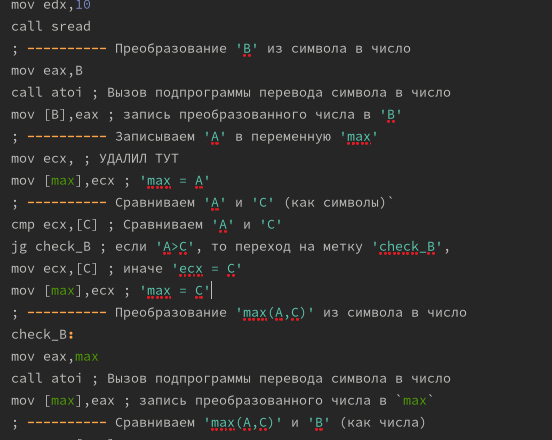{#fig:009 width=70%}

# Самостоятельная работа
## 1 задание
Мой код для программы, находящей наименьшую из 3 переменных 94б 5б 58 (рис. @fig:010).

```ASM
%include 'in_out.asm'
section .data
msg2 db "Наименьшее из трёх чисел:",0h
A dd '94'
B dd '5'
C dd '58'
section .bss
min resb 10
section .text
global _start
_start:
mov eax,C
call atoi ; Вызов подпрограммы перевода символа в число
mov [C],eax ; запись преобразованного числа в 'C'
; ---------- Записываем 'A' в переменную 'min'
mov ecx,[A] ; 'ecx = A'
mov [min],ecx ; 'max = A'
; ---------- Сравниваем 'A' и 'B' (как символы)
cmp ecx,[B] ; Сравниваем 'A' и 'B'
jl check_C ; если 'A<B', то переход на метку 'check_C',
mov ecx,[B] ; иначе 'ecx = B'
mov [min],ecx ; 'min = B'
; ---------- Преобразование 'max(A,C)' из символа в число
check_C:
mov eax,min
call atoi ; Вызов подпрограммы перевода символа в число
mov [min],eax ; запись преобразованного числа в min
; ---------- Сравниваем 'min(A,B)' и 'C' (как числа)
mov ecx,[min]
cmp ecx,[C] ; Сравниваем 'min(A,B)' и 'C'
jl fin ; если 'min(A,B)<C', то переход на 'fin',
mov ecx,[C] ; иначе 'ecx = C'
mov [min],ecx
; ---------- Вывод результата
fin:
mov eax, msg2
call sprint ; Вывод сообщения 'Наименьшее число: '
mov eax,[min]
call iprintLF ; Вывод 'min(A,B,C)'
call quit ; Выход
```

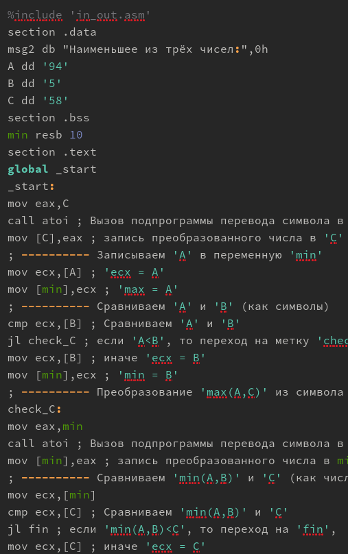{#fig:010 width=70%}

Результат работы моего кода (рис. @fig:011).

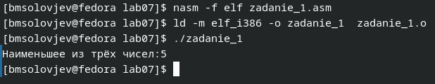{#fig:011 width=70%}

## 2 задание

Мой вариант - 3, поэтому я написал код, который запрашивает 2 числа, и если первое не равно 3, то выводит второе число + 1, а если равно 3, то умножает первое число на 3(рис. @fig:012).

```asm
%include 'in_out.asm'
section .data
msg1 db 'Введите х: ',0h
msg2 db 'Введите а: ',0h
section .bss
x resb 10
a resb 10
n resb 10
section .text
global _start
_start:
; ---------- Вывод сообщения 'Введите x: '
mov eax,msg1
call sprint
; ---------- Ввод 'x'
mov ecx,x
mov edx, 80
call sread
; ---------- Преобразование 'x' из символа в число
mov eax,x
call atoi ; Вызов подпрограммы перевода символа в число
mov [x],eax ; запись преобразованного числа в 'x'

; ---------- Вывод сообщения 'Введите a: '
mov eax,msg2
call sprint
; ---------- Ввод 'a'
mov ecx,a
call sread
; ---------- Преобразование 'a' из символа в число
mov eax,a
call atoi ; Вызов подпрограммы перевода символа в число
mov [a],eax ; запись преобразованного числа в 'a'

; --------- Функция
mov eax, 3
cmp eax, [x]
jne fin
jmp fin1

; ---------- Вывод результата
fin1:
mov eax, [a]
add eax, 1 
mov [a],eax
mov eax, [a] ;
call iprintLF ; 

call quit ; Выход

fin:
mov eax, [x]
mov ebx, 3
mul ebx
mov [x],eax
mov eax, [x] ;
call iprintLF ; 

call quit ; Выход
```

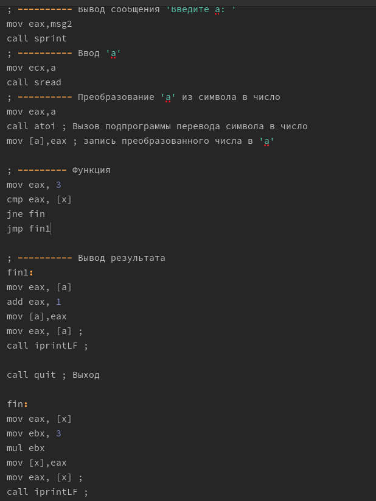{#fig:012 width=70%}

Проверка работы кода (рис. @fig:013).

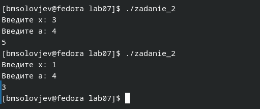{#fig:013 width=70%}

# Выводы

Выполнив данную лабораторную работу, я изучил команды условного и безусловного перехода. Приобрёл навыки написания программ с использованием переходов. Познакомился с назначением и структурой файла листинга.

# Список литературы{.unnumbered}

::: {#refs}
:::
