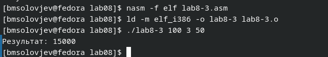

---
## Front matter
title: "Лабораторная работа №8"
subtitle: "Программирование цикла. Обработка аргументов командной строки"
author: "Соловьев Богдан Михайлович"

## Generic otions
lang: ru-RU
toc-title: "Содержание"

## Bibliography
bibliography: bib/cite.bib
csl: pandoc/csl/gost-r-7-0-5-2008-numeric.csl

## Pdf output format
toc: true # Table of contents
toc-depth: 2
lof: true # List of figures
lot: true # List of tables
fontsize: 12pt
linestretch: 1.5
papersize: a4
documentclass: scrreprt
## I18n polyglossia
polyglossia-lang:
  name: russian
  options:
	- spelling=modern
	- babelshorthands=true
polyglossia-otherlangs:
  name: english
## I18n babel
babel-lang: russian
babel-otherlangs: english
## Fonts
mainfont: PT Serif
romanfont: PT Serif
sansfont: PT Sans
monofont: PT Mono
mainfontoptions: Ligatures=TeX
romanfontoptions: Ligatures=TeX
sansfontoptions: Ligatures=TeX,Scale=MatchLowercase
monofontoptions: Scale=MatchLowercase,Scale=0.9
## Biblatex
biblatex: true
biblio-style: "gost-numeric"
biblatexoptions:
  - parentracker=true
  - backend=biber
  - hyperref=auto
  - language=auto
  - autolang=other*
  - citestyle=gost-numeric
## Pandoc-crossref LaTeX customization
figureTitle: "Рис."
tableTitle: "Таблица"
listingTitle: "Листинг"
lofTitle: "Список иллюстраций"
lotTitle: "Список таблиц"
lolTitle: "Листинги"
## Misc options
indent: true
header-includes:
  - \usepackage{indentfirst}
  - \usepackage{float} # keep figures where there are in the text
  - \floatplacement{figure}{H} # keep figures where there are in the text
---

# Цель работы

Приобретение навыков написания программ с использованием циклов и обработкой
аргументов командной строки.

# Теоретическое введение

Стек — это структура данных, организованная по принципу LIFO («Last In — First Out»
или «последним пришёл — первым ушёл»). Стек является частью архитектуры процессора и
реализован на аппаратном уровне. Для работы со стеком в процессоре есть специальные
регистры (ss, bp, sp) и команды.

Основной функцией стека является функция сохранения адресов возврата и передачи
аргументов при вызове процедур. Кроме того, в нём выделяется память для локальных
переменных и могут временно храниться значения регистров.

Стек имеет вершину, адрес последнего добавленного элемента, который хранится в регистре esp (указатель стека). Противоположный конец стека называется дном. Значение,
помещённое в стек последним, извлекается первым. При помещении значения в стек указатель стека уменьшается, а при извлечении — увеличивается.

Для стека существует две основные операции:

• добавление элемента в вершину стека (push);

• извлечение элемента из вершины стека (pop).

Команда push размещает значение в стеке, т.е. помещает значение в ячейку памяти, на
которую указывает регистр esp, после этого значение регистра esp увеличивается на 4.
Данная команда имеет один операнд — значение, которое необходимо поместить в стек.

# Выполнение лабораторной работы

Создаю файл lab8-1.asm (рис. @fig:001).

{#fig:001 width=70%}

Записываю в созданный файл следующий код (рис. @fig:002).

{#fig:002 width=70%}

Проверка работы созданного файла (рис. @fig:003).

{#fig:003 width=70%}

Изменяю код программы, теперь значение в регистре ecx не запоминается, и количество циклов становится бесконечным (рис. @fig:004).

{#fig:004 width=70%}

Файл создаёт бесконечный цикл (рис. @fig:005).

{#fig:005 width=70%}

Изменяю код программы таким образом, чтобы в заносить и вытаскивать из стека значение счётчика цикла (рис. @fig:006).

{#fig:006 width=70%}

Теперь программа снова работает корректно, и количество циклов соответствует N (рис. @fig:007).

{#fig:007 width=70%}

Создаю новый файл и ввожу в него новый текст программы (рис. @fig:008).

{#fig:008 width=70%}

Проверка работы нового файла. При таком запросе программа обработала 4 аргумента (рис. @fig:009).

{#fig:009 width=70%}

Создаю новую программу, которая вычисляет сумму аргументов командной строки (рис. @fig:010).

```nasm
%include 'in_out.asm'
SECTION .data
msg db "Результат: ",0
SECTION .text
global _start
_start:
pop ecx ; Извлекаем из стека в `ecx` количество
; аргументов (первое значение в стеке)
pop edx ; Извлекаем из стека в `edx` имя программы
; (второе значение в стеке)
sub ecx,1 ; Уменьшаем `ecx` на 1 (количество
; аргументов без названия программы)
mov esi, 0 ; Используем `esi` для хранения
; промежуточных сумм
next:
cmp ecx,0h ; проверяем, есть ли еще аргументы
jz _end ; если аргументов нет выходим из цикла
; (переход на метку `_end`)
pop eax ; иначе извлекаем следующий аргумент из стека
call atoi ; преобразуем символ в число
add esi,eax ; добавляем к промежуточной сумме
; след. аргумент `esi=esi+eax`
loop next ; переход к обработке следующего аргумента
_end:
mov eax, msg ; вывод сообщения "Результат: "
call sprint
mov eax, esi ; записываем сумму в регистр `eax`
call iprintLF ; печать результата
call quit ; завершение программы
```

{#fig:010 width=70%}

Теперь меняю текст программы таким образом, чтобы она вычисляла произведение (рис. @fig:011).

{#fig:011 width=70%}

Проверка работы нового файла.  (рис. @fig:012).

{#fig:012 width=70%}

# Самостоятельная работа

Текст программы, считающей сумму значений функции f(x) = 10x -5 (рис. @fig:013).

```nasm
%include 'in_out.asm'
SECTION .data
msg0 db "f(x) = 10x - 5",0
msg db "Результат: ",0

SECTION .text
global _start
_start:
pop ecx ; Извлекаем из стека в `ecx` количество
; аргументов (первое значение в стеке)
pop edx ; Извлекаем из стека в `edx` имя программы
; (второе значение в стеке)
sub ecx,1 ; Уменьшаем `ecx` на 1 (количество
; аргументов без названия программы)
mov esi, 0; Используем `esi` для хранения
; промежуточных сумм
next:
cmp ecx,0h ; проверяем, есть ли еще аргументы
jz _end ; если аргументов нет выходим из цикла
; (переход на метку `_end`)
pop eax ; иначе извлекаем следующий аргумент из стека
call atoi ; преобразуем символ в число
mov ebx, 10
mul ebx
add eax, -5
add esi, eax
; след. аргумент `esi=esi+eax`
loop next ; переход к обработке следующего аргумента
_end:
mov eax, msg0
call sprintLF
mov eax, msg ; вывод сообщения "Результат: "
call sprint
mov eax, esi ; записываем сумму в регистр `eax`
call iprintLF ; печать результата
call quit ; завершение программы

```
{#fig:013 width=70%}

Проверка работы программы  (рис. @fig:014).

{#fig:014 width=70%}

# Выводы

Выполнив эту лабораторную работу, я приобрёл навыки написания программ с использованием циклов и обработкой аргументов командной строки.


# Список литературы{.unnumbered}

::: {#refs}
:::
