---
## Front matter
title: "Лабораторная работа номер 9"
subtitle: "Понятие подпрограммы. Отладчик GDB."
author: "Соловьев Богдан Михайлович"

## Generic otions
lang: ru-RU
toc-title: "Содержание"

## Bibliography
bibliography: bib/cite.bib
csl: pandoc/csl/gost-r-7-0-5-2008-numeric.csl

## Pdf output format
toc: true # Table of contents
toc-depth: 2
lof: true # List of figures
lot: true # List of tables
fontsize: 12pt
linestretch: 1.5
papersize: a4
documentclass: scrreprt
## I18n polyglossia
polyglossia-lang:
  name: russian
  options:
	- spelling=modern
	- babelshorthands=true
polyglossia-otherlangs:
  name: english
## I18n babel
babel-lang: russian
babel-otherlangs: english
## Fonts
mainfont: PT Serif
romanfont: PT Serif
sansfont: PT Sans
monofont: PT Mono
mainfontoptions: Ligatures=TeX
romanfontoptions: Ligatures=TeX
sansfontoptions: Ligatures=TeX,Scale=MatchLowercase
monofontoptions: Scale=MatchLowercase,Scale=0.9
## Biblatex
biblatex: true
biblio-style: "gost-numeric"
biblatexoptions:
  - parentracker=true
  - backend=biber
  - hyperref=auto
  - language=auto
  - autolang=other*
  - citestyle=gost-numeric
## Pandoc-crossref LaTeX customization
figureTitle: "Рис."
tableTitle: "Таблица"
listingTitle: "Листинг"
lofTitle: "Список иллюстраций"
lotTitle: "Список таблиц"
lolTitle: "Листинги"
## Misc options
indent: true
header-includes:
  - \usepackage{indentfirst}
  - \usepackage{float} # keep figures where there are in the text
  - \floatplacement{figure}{H} # keep figures where there are in the text
---

# Цель работы

Приобретение навыков написания программ с использованием подпрограмм. Знакомство
с методами отладки при помощи GDB и его основными возможностями.

# Теоретическое введение

Отладка — это процесс поиска и исправления ошибок в программе. В общем случае его
можно разделить на четыре этапа:

• обнаружение ошибки;
• поиск её местонахождения;
• определение причины ошибки;
• исправление ошибки.

Можно выделить следующие типы ошибок:

• синтаксические ошибки — обнаруживаются во время трансляции исходного кода и
вызваны нарушением ожидаемой формы или структуры языка;
• семантические ошибки — являются логическими и приводят к тому, что программа
запускается, отрабатывает, но не даёт желаемого результата;
• ошибки в процессе выполнения — не обнаруживаются при трансляции и вызывают прерывание выполнения программы (например, это ошибки, связанные с переполнением
или делением на ноль).

Второй этап — поиск местонахождения ошибки. Некоторые ошибки обнаружить довольно трудно. Лучший способ найти место в программе, где находится ошибка, это разбить
программу на части и произвести их отладку отдельно друг от друга.
Третий этап — выяснение причины ошибки. После определения местонахождения ошибки
обычно проще определить причину неправильной работы программы.

Последний этап — исправление ошибки. После этого при повторном запуске программы,
может обнаружиться следующая ошибка, и процесс отладки начнётся заново.

Наиболее часто применяют следующие методы отладки:

• создание точек контроля значений на входе и выходе участка программы (например,
вывод промежуточных значений на экран — так называемые диагностические сообщения);

• использование специальных программ-отладчиков.
Отладчики позволяют управлять ходом выполнения программы, контролировать и изменять данные. Это помогает быстрее найти место ошибки в программе и ускорить её
исправление. Наиболее популярные способы работы с отладчиком — это использование
точек останова и выполнение программы по шагам.
Пошаговое выполнение — это выполнение программы с остановкой после каждой строчки,
чтобы программист мог проверить значения переменных и выполнить другие действия.
Точки останова — это специально отмеченные места в программе, в которых программаотладчик приостанавливает выполнение программы и ждёт команд. Наиболее популярные
виды точек останова:

• Breakpoint — точка останова (остановка происходит, когда выполнение доходит до
определённой строки, адреса или процедуры, отмеченной программистом);
• Watchpoint — точка просмотра (выполнение программы приостанавливается, если
программа обратилась к определённой переменной: либо считала её значение, либо
изменила его).

Точки останова устанавливаются в отладчике на время сеанса работы с кодом программы, т.е. они сохраняются до выхода из программы-отладчика или до смены отлаживаемой
программы

# Выполнение лабораторной работы

Создаю файл lab09-1.asm (рис. @fig:001).

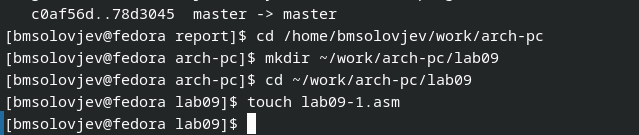{#fig:001 width=70%}

Ввожу в созданный файл код программы, считающей выражение 2𝑥 + 7 с помощью подпрограммы _calcul.(рис. @fig:002).

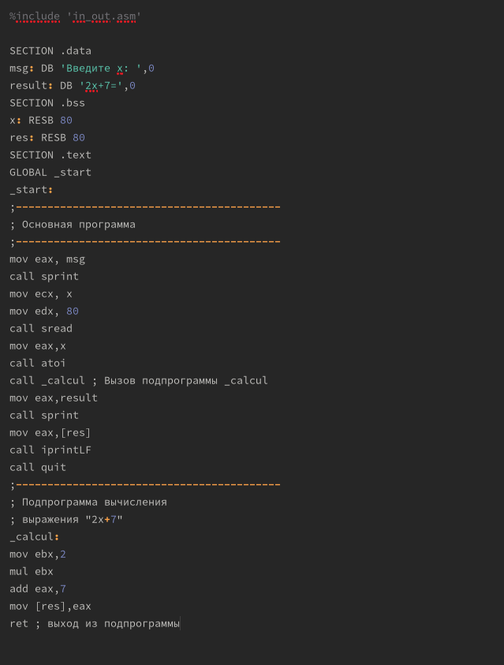{#fig:002 width=70%}

Проверяю код (рис. @fig:003).

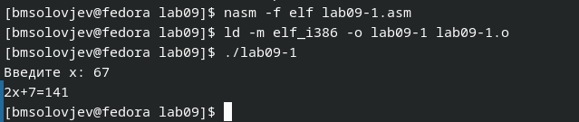{#fig:003 width=70%}

Изменяю текст программы таким образом, чтобы подпрограмма _subcalcul считала 3𝑥 − 1 (рис. @fig:004).

{#fig:004 width=70%}

Проверяю код (рис. @fig:005).

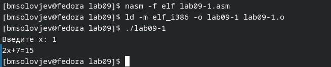{#fig:005 width=70%}

Создаю новый файл lab09-2.asm (рис. @fig:006).

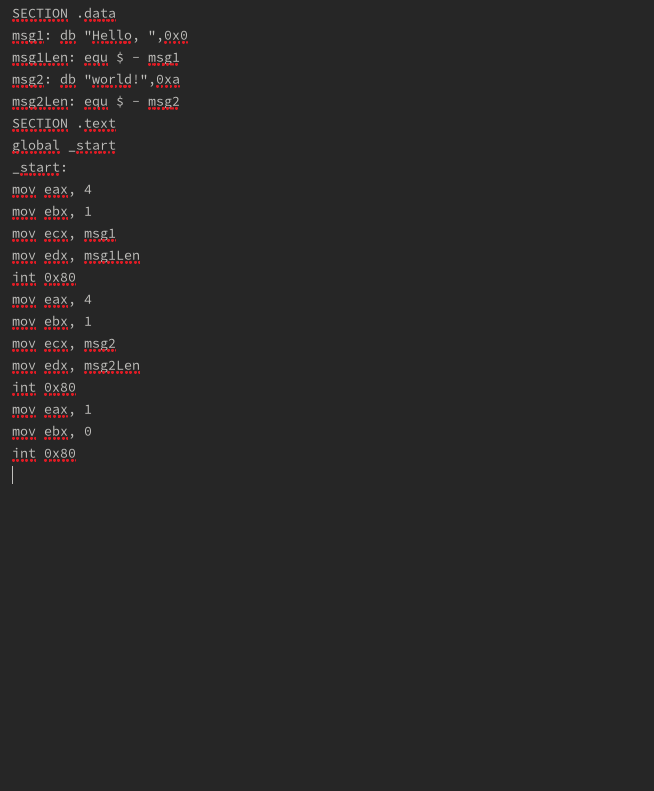{#fig:006 width=70%}

Проверяю работу программы, запустив ее в оболочке GDB с помощью команды run (1) (рис. @fig:007).

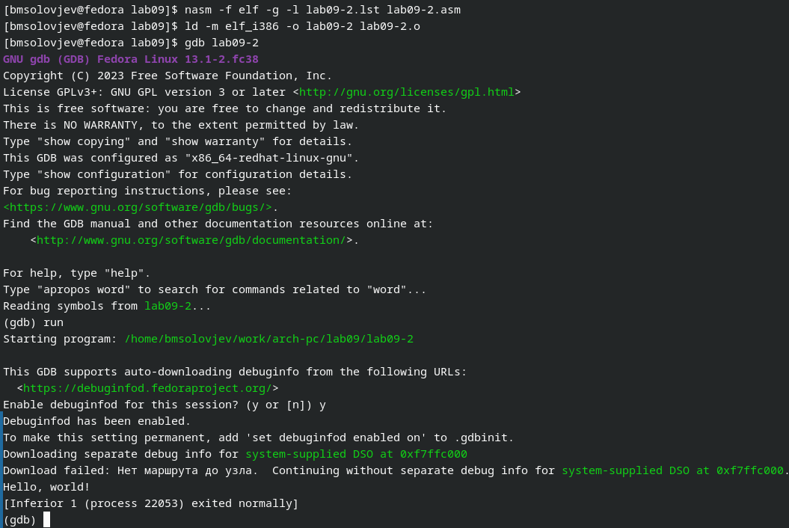{#fig:007 width=70%}

Проверяю работу программы, запустив ее в оболочке GDB с помощью команды run (2) (рис. @fig:008).

{#fig:008 width=70%}

Сравниваю различия отображения синтаксиса машинных команд в режимах ATT и Intel. Отличие есть только в порядке отображения адреса регистра и самого регистра(рис. @fig:009).

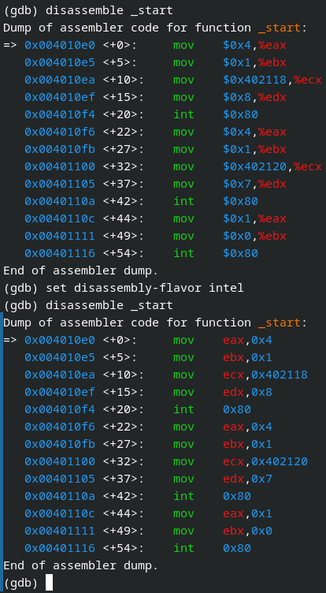{#fig:009 width=70%}

Включаю режим псевдографики для более удобного анализа программы (1)(рис. @fig:010).

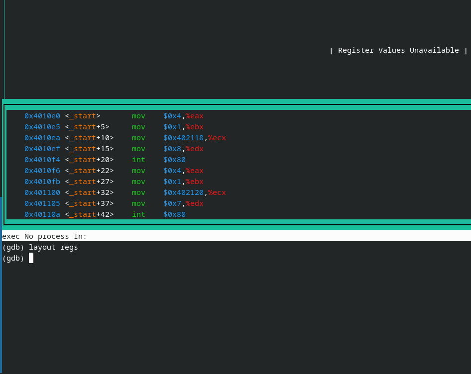{#fig:010 width=70%}

Включаю режим псевдографики для более удобного анализа программы (2) (рис. @fig:011).

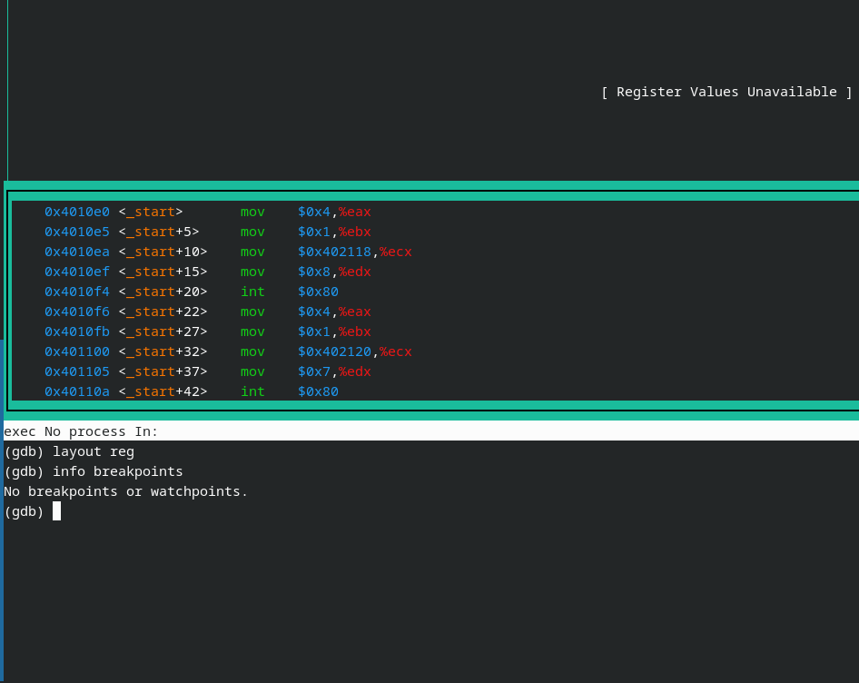{#fig:011 width=70%}

Устанавливая break point (рис. @fig:012).

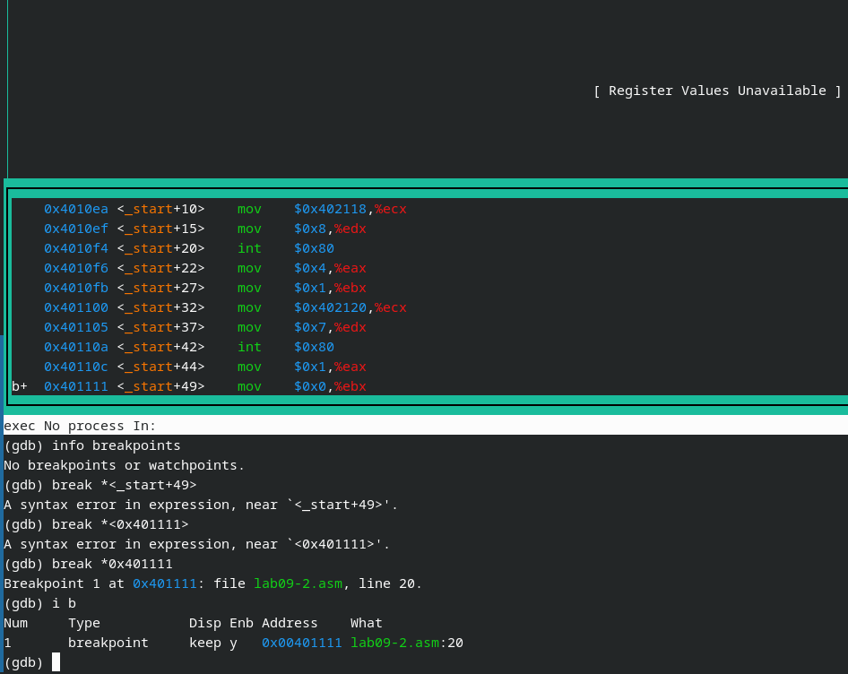{#fig:012 width=70%}

Просматриваю значение msg1 по имени (рис. @fig:013).

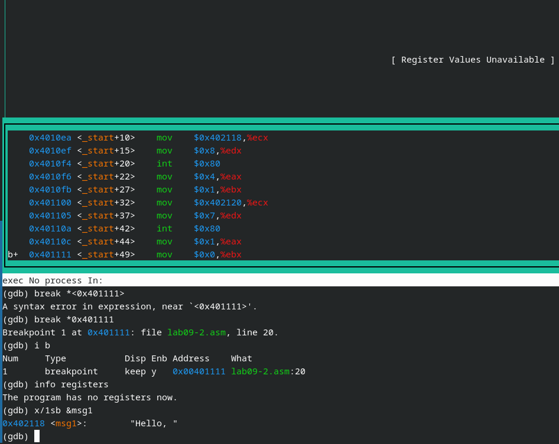{#fig:013 width=70%}

Просматриваю значение msg2 по имени (рис. @fig:014).

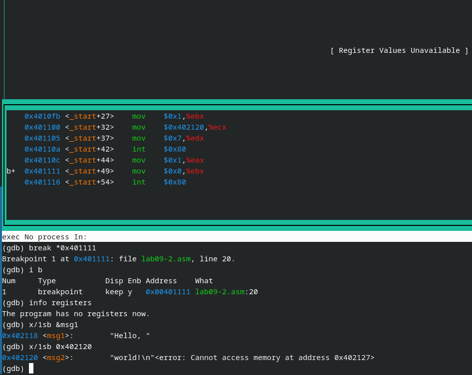{#fig:014 width=70%}

Пытаюсь заменить символ (почему-то выдаёт ошибку )(рис. @fig:015).

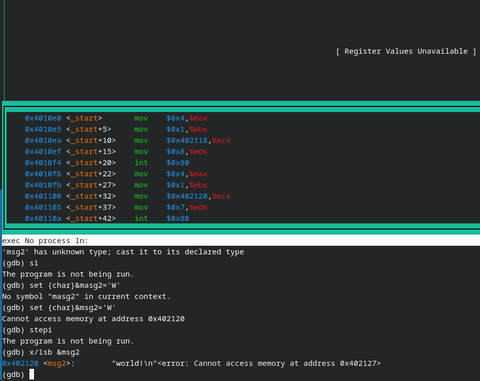{#fig:015 width=70%}

Повторяю действия из конспекта, потом загружаю в gdb программу с аргументами командой gdb --args lab09-3 аргумент1 аргумент 2 'аргумент 3' (рис. @fig:016).

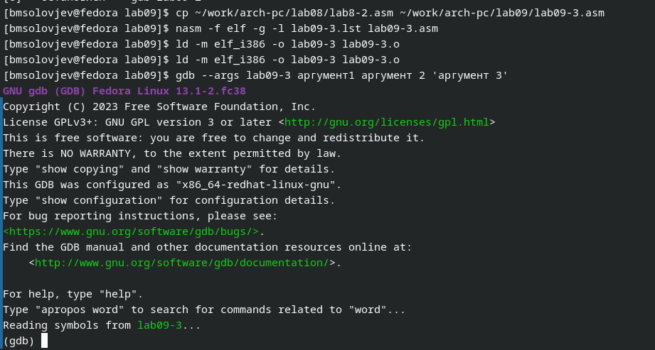{#fig:016 width=70%}

Узнаю адрес вершины стека, в которого загрузились аргументы (рис. @fig:017).

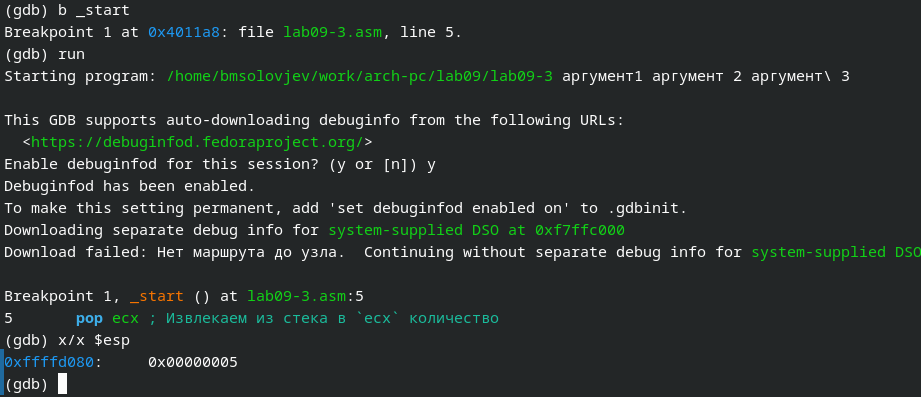{#fig:017 width=70%}

Смотрю остальные позиции из стека. Их адреса находятся на одинаковом, потому что программа заранее не знает сколько места займёт каждая переменная, и поэтому места выделено на каждый элемент одинаково (рис. @fig:018).

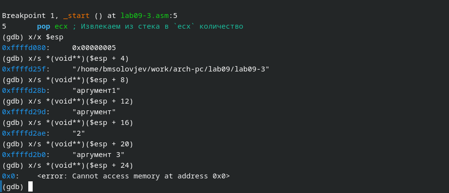{#fig:018 width=70%}

# Самостоятельная работа

Я изменил код программы из прошлой лабораторной таким образом, чтобы там была подпрограмма (рис. @fig:019).

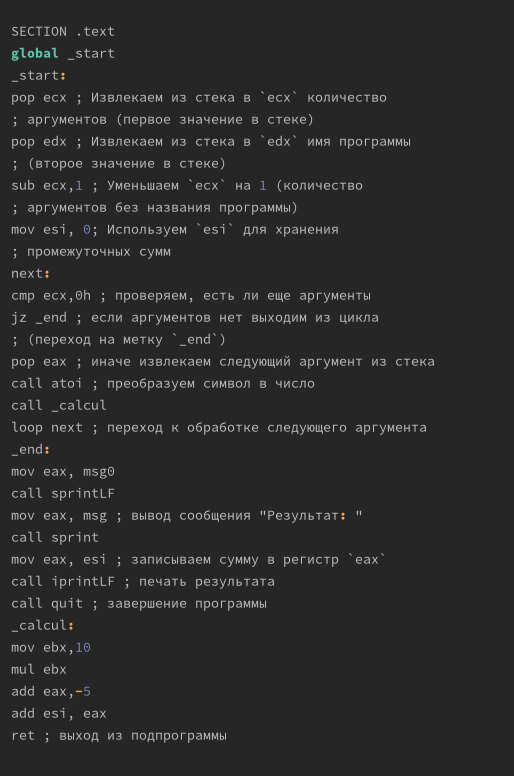{#fig:019 width=70%}

Проверяю правильность кода (рис. @fig:020).

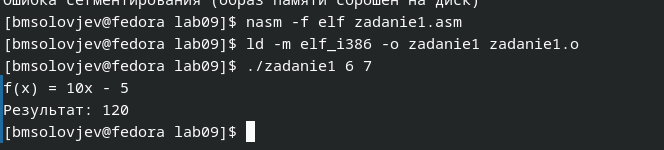{#fig:020 width=70%}

Чтобы код работал правильно, мне пришлось заменить add ebx, eax на add eax,ebx, а mov edi, ebx на mov edi, eax (рис. @fig:021).

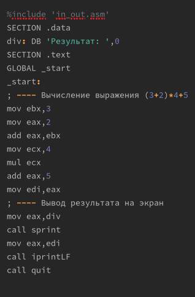{#fig:021 width=70%}

Проверка правильност кода (рис. @fig:022).

{#fig:022 width=70%}

# Выводы

Выполнив данную лабораторную работу, я приобрёл навыки написания программ с использованием подпрограмм. Познакомился с методами отладки при помощи GBD и его основными возможностями.

# Список литературы{.unnumbered}

::: {#refs}
:::
